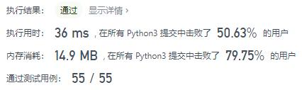
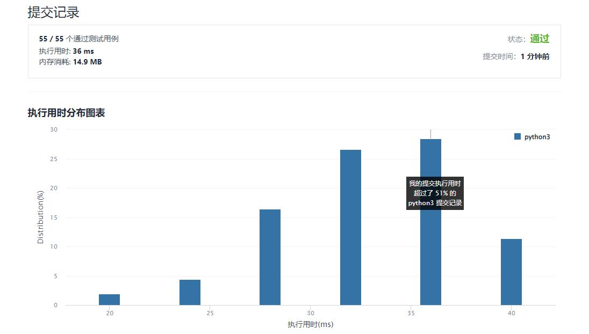

# 537-复数乘法

Author：_Mumu

创建日期：2022/02/25

通过日期：2022/02/25

*****

踩过的坑：

1. 轻松愉快
2. 复数乘法还有啥好说的，这题咋还能中等

已解决：261/2539

*****

难度：中等

问题描述：

复数 可以用字符串表示，遵循 "实部+虚部i" 的形式，并满足下述条件：

实部 是一个整数，取值范围是 [-100, 100]
虚部 也是一个整数，取值范围是 [-100, 100]
i2 == -1
给你两个字符串表示的复数 num1 和 num2 ，请你遵循复数表示形式，返回表示它们乘积的字符串。

 

示例 1：

输入：num1 = "1+1i", num2 = "1+1i"
输出："0+2i"
解释：(1 + i) * (1 + i) = 1 + i2 + 2 * i = 2i ，你需要将它转换为 0+2i 的形式。
示例 2：

输入：num1 = "1+-1i", num2 = "1+-1i"
输出："0+-2i"
解释：(1 - i) * (1 - i) = 1 + i2 - 2 * i = -2i ，你需要将它转换为 0+-2i 的形式。 

提示：

num1 和 num2 都是有效的复数表示。

来源：力扣（LeetCode）
链接：https://leetcode-cn.com/problems/complex-number-multiplication