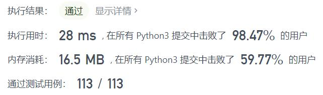
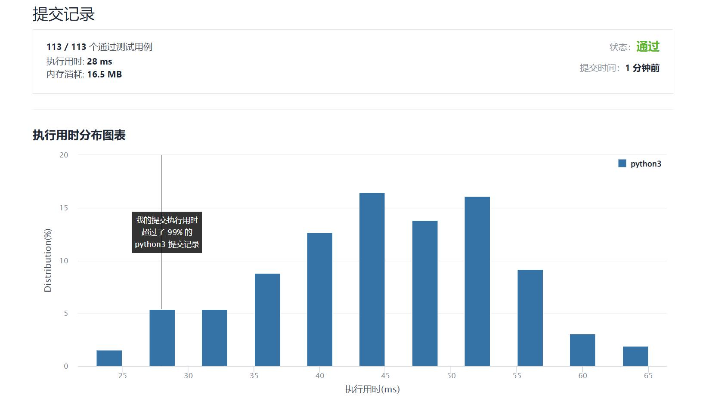

# 539-最小时间差

Author：_Mumu

创建日期：2022/01/18

通过日期：2022/01/18

*****

踩过的坑：

1. 轻松愉快的暴力解法，排序一下可以加速

已解决：211/2497

*****

难度：中等

问题描述：

给定一个 24 小时制（小时:分钟 "HH:MM"）的时间列表，找出列表中任意两个时间的最小时间差并以分钟数表示。

 

示例 1：

输入：timePoints = ["23:59","00:00"]
输出：1
示例 2：

输入：timePoints = ["00:00","23:59","00:00"]
输出：0

提示：

2 <= timePoints.length <= 2 * 104
timePoints[i] 格式为 "HH:MM"

来源：力扣（LeetCode）
链接：https://leetcode-cn.com/problems/minimum-time-difference
