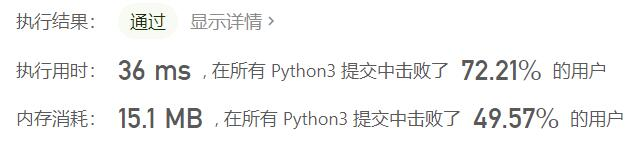
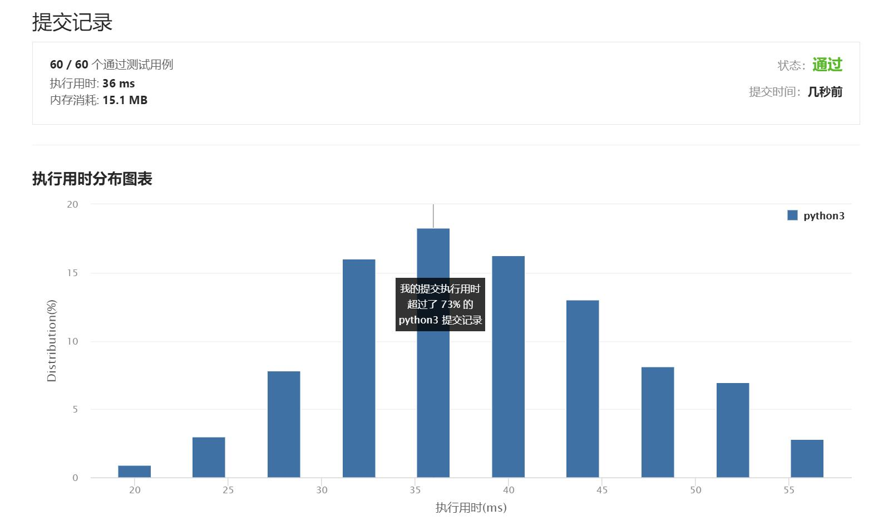

# 541-反转字符串II

Author：_Mumu

创建日期：2021/8/20

通过日期：2021/8/20

*****

踩过的坑：

1. 乍一看很简单，实际写起来还是有一点坑的
2. 执行用时28s的实例写得很优雅

已解决：65/2317

*****

难度：简单

问题描述：

给定一个字符串 s 和一个整数 k，从字符串开头算起，每 2k 个字符反转前 k 个字符。

如果剩余字符少于 k 个，则将剩余字符全部反转。
如果剩余字符小于 2k 但大于或等于 k 个，则反转前 k 个字符，其余字符保持原样。

示例 1：

输入：s = "abcdefg", k = 2
输出："bacdfeg"
示例 2：

输入：s = "abcd", k = 2
输出："bacd"

提示：

1 <= s.length <= 104
s 仅由小写英文组成
1 <= k <= 104

来源：力扣（LeetCode）
链接：https://leetcode-cn.com/problems/reverse-string-ii
