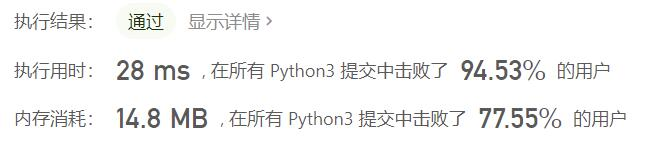

# 551-学生出勤记录I

Author：_Mumu

创建日期：2021/8/17

通过日期：2021/8/17

*****

踩过的坑：

1. 我起了，一刀秒了，没什么好说的
2. 这也太简单了
3. 不过值得注意的是判断条件`'LLL' in s`放在`s.count('A')`前面与放在后面相比，运行时间更慢并且内存占用更高
4. 盲猜明天是学生出勤记录II
5. 看评论说到`'LLL'`不能过`'LLA'`却可以，笑死

已解决：64/2316

*****

难度：简单

问题描述：

给你一个字符串 s 表示一个学生的出勤记录，其中的每个字符用来标记当天的出勤情况（缺勤、迟到、到场）。记录中只含下面三种字符：

'A'：Absent，缺勤
'L'：Late，迟到
'P'：Present，到场
如果学生能够 同时 满足下面两个条件，则可以获得出勤奖励：

按 总出勤 计，学生缺勤（'A'）严格 少于两天。
学生 不会 存在 连续 3 天或 3 天以上的迟到（'L'）记录。
如果学生可以获得出勤奖励，返回 true ；否则，返回 false 。

 

示例 1：

输入：s = "PPALLP"
输出：true
解释：学生缺勤次数少于 2 次，且不存在 3 天或以上的连续迟到记录。
示例 2：

输入：s = "PPALLL"
输出：false
解释：学生最后三天连续迟到，所以不满足出勤奖励的条件。

提示：

1 <= s.length <= 1000
s[i] 为 'A'、'L' 或 'P'

来源：力扣（LeetCode）
链接：https://leetcode-cn.com/problems/student-attendance-record-i
