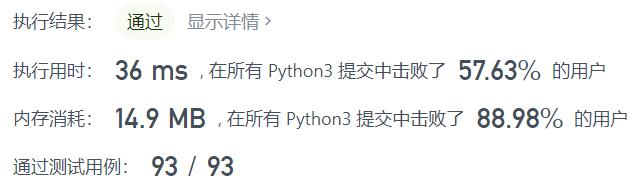
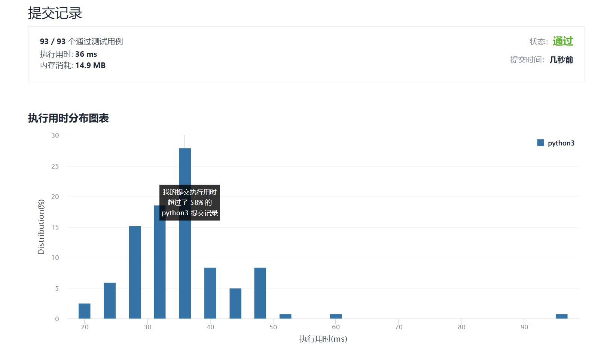

# 553-最优除法

Author：_Mumu

创建日期：2022/02/27

通过日期：2022/02/27

*****

踩过的坑：

1. 啊这。。
2. 让一个式子最小就是不加任何括号
3. 让一个式子最大就是让第一项不动，第二项及之后的式子最小，也就是把除了第一项以外全部框起来就好了
4. 上面这些能成立是因为每一项都是正整数，如果有小数就不一样了

已解决：263/2539

*****

难度：中等

问题描述：

给定一组正整数，相邻的整数之间将会进行浮点除法操作。例如， [2,3,4] -> 2 / 3 / 4 。

但是，你可以在任意位置添加任意数目的括号，来改变算数的优先级。你需要找出怎么添加括号，才能得到最大的结果，并且返回相应的字符串格式的表达式。你的表达式不应该含有冗余的括号。

示例：

输入: [1000,100,10,2]
输出: "1000/(100/10/2)"
解释:
1000/(100/10/2) = 1000/((100/10)/2) = 200
但是，以下加粗的括号 "1000/((100/10)/2)" 是冗余的，
因为他们并不影响操作的优先级，所以你需要返回 "1000/(100/10/2)"。

其他用例:
1000/(100/10)/2 = 50
1000/(100/(10/2)) = 50
1000/100/10/2 = 0.5
1000/100/(10/2) = 2
说明:

输入数组的长度在 [1, 10] 之间。
数组中每个元素的大小都在 [2, 1000] 之间。
每个测试用例只有一个最优除法解。

来源：力扣（LeetCode）
链接：https://leetcode-cn.com/problems/optimal-division