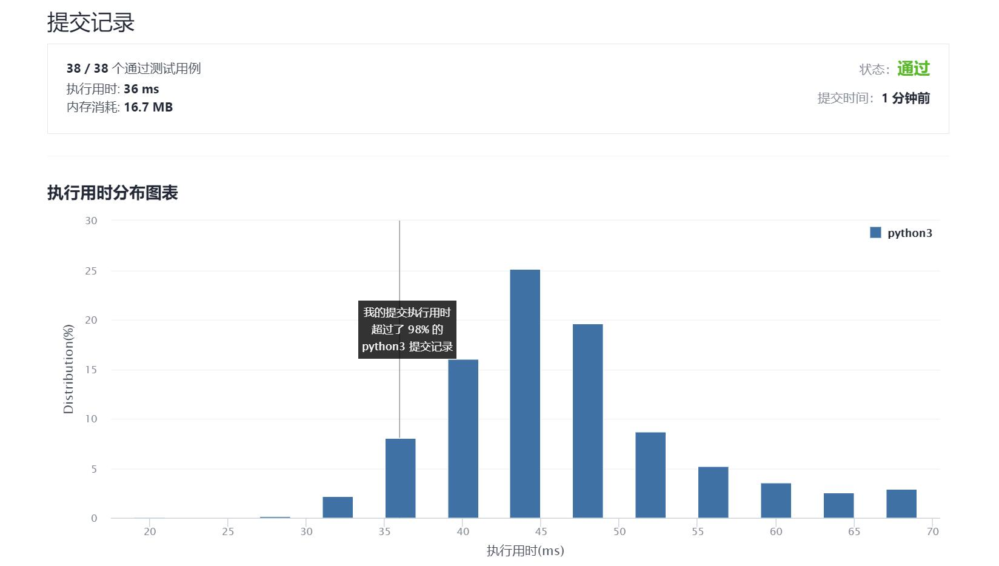

# 559-N叉树的最大深度

Author：_Mumu

创建日期：2021/11/21

通过日期：2021/11/21

*****

踩过的坑：

1. 简单的dfs啦
2. 虽然用`max`和生成器可以一行解决战斗看起来很牛逼，但感觉时空复杂度都略微劣于老老实实dfs
3. 不要忘记处理空树的情况啊

已解决：153/2432

*****

难度：简单

问题描述：

给定一个 N 叉树，找到其最大深度。

最大深度是指从根节点到最远叶子节点的最长路径上的节点总数。

N 叉树输入按层序遍历序列化表示，每组子节点由空值分隔（请参见示例）。

 

示例 1：

输入：root = [1,null,3,2,4,null,5,6]
输出：3
示例 2：

输入：root = [1,null,2,3,4,5,null,null,6,7,null,8,null,9,10,null,null,11,null,12,null,13,null,null,14]
输出：5

提示：

树的深度不会超过 1000 。
树的节点数目位于 [0, 104] 之间。

来源：力扣（LeetCode）
链接：https://leetcode-cn.com/problems/maximum-depth-of-n-ary-tree
