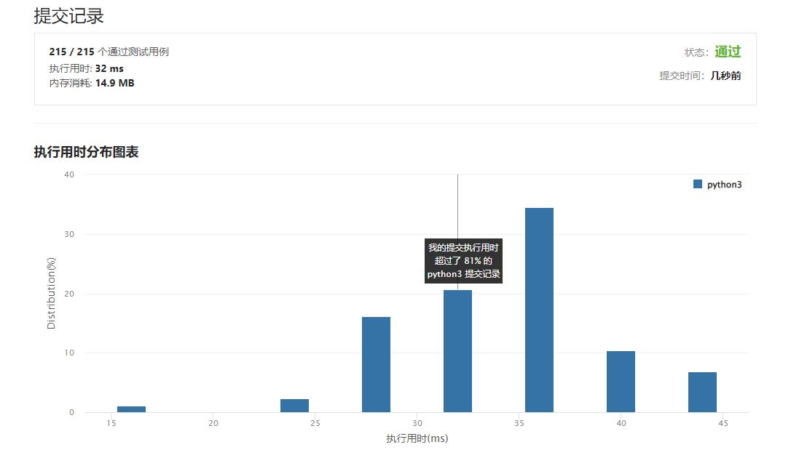

# 564-寻找最近的回文数

Author：_Mumu

创建日期：2022/03/02

通过日期：2022/03/02

*****

踩过的坑：

1. 啊这，害挺麻烦。。但是思路又不难。。

已解决：266/2543

*****

难度：困难

问题描述：

给定一个表示整数的字符串 n ，返回与它最近的回文整数（不包括自身）。如果不止一个，返回较小的那个。

“最近的”定义为两个整数差的绝对值最小。

 

示例 1:

输入: n = "123"
输出: "121"
示例 2:

输入: n = "1"
输出: "0"
解释: 0 和 2是最近的回文，但我们返回最小的，也就是 0。

提示:

1 <= n.length <= 18
n 只由数字组成
n 不含前导 0
n 代表在 [1, 1018 - 1] 范围内的整数

来源：力扣（LeetCode）
链接：https://leetcode-cn.com/problems/find-the-closest-palindrome