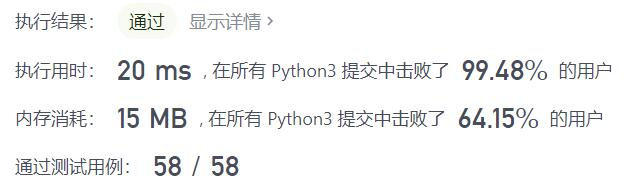
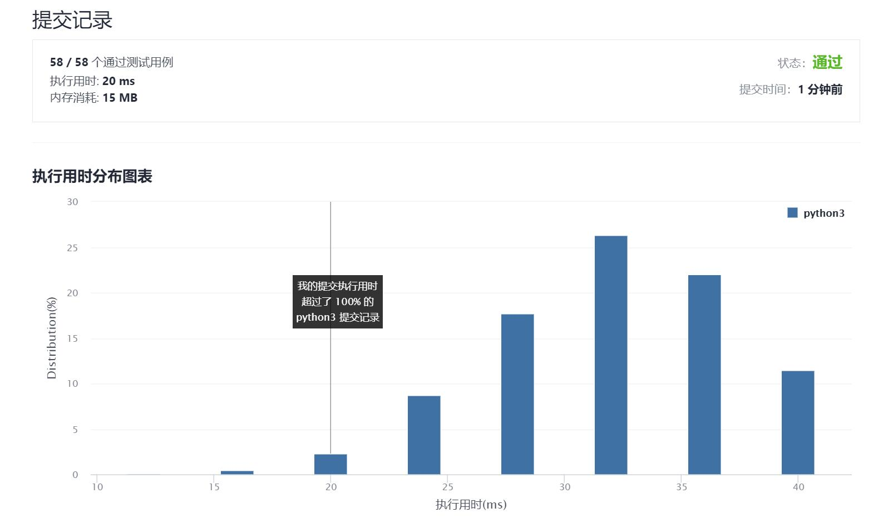

# 58-最后一个单词的长度

Author：_Mumu

创建日期：2021/9/21

通过日期：2021/9/21

*****

踩过的坑：

1. 反向遍历搞定
2. 或者也可以直接`return len(s.split()[-1])`

已解决：95/2363

*****

难度：简单

问题描述：

给你一个字符串 s，由若干单词组成，单词前后用一些空格字符隔开。返回字符串中最后一个单词的长度。

单词 是指仅由字母组成、不包含任何空格字符的最大子字符串。

 

示例 1：

输入：s = "Hello World"
输出：5
示例 2：

输入：s = "   fly me   to   the moon  "
输出：4
示例 3：

输入：s = "luffy is still joyboy"
输出：6

提示：

1 <= s.length <= 104
s 仅有英文字母和空格 ' ' 组成
s 中至少存在一个单词

来源：力扣（LeetCode）
链接：https://leetcode-cn.com/problems/length-of-last-word
