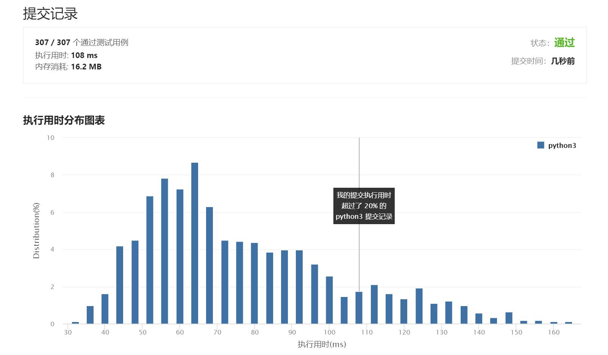

# 581-最短无序连续子数组

Author：_Mumu

创建日期：2021/8/3

通过日期：2021/8/3

*****

踩过的坑：

1. 我起了，看题解了
2. 记`mn[i]`为$[i, n-1]$​中最小的数，`mx[i]`为$[0, i-1]$​​中最大的数，核心思路是分别从左往右和从右往左找到第一个使得`mn[i] < mx[i]`的下标，这样就找到了需要排序的子序列的左右边界
3. 建议看题解里【GTAlgorithm】的解答，很清晰，一看就会

已解决：60/2299

*****

难度：中等

问题描述：

给你一个整数数组 nums ，你需要找出一个 连续子数组 ，如果对这个子数组进行升序排序，那么整个数组都会变为升序排序。

请你找出符合题意的 最短 子数组，并输出它的长度。

 

示例 1：

输入：nums = [2,6,4,8,10,9,15]
输出：5
解释：你只需要对 [6, 4, 8, 10, 9] 进行升序排序，那么整个表都会变为升序排序。
示例 2：

输入：nums = [1,2,3,4]
输出：0
示例 3：

输入：nums = [1]
输出：0

提示：

1 <= nums.length <= 104
-105 <= nums[i] <= 105

进阶：你可以设计一个时间复杂度为 O(n) 的解决方案吗？

来源：力扣（LeetCode）
链接：https://leetcode-cn.com/problems/shortest-unsorted-continuous-subarray