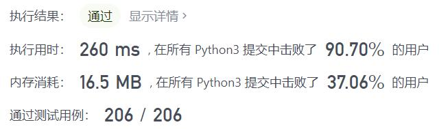
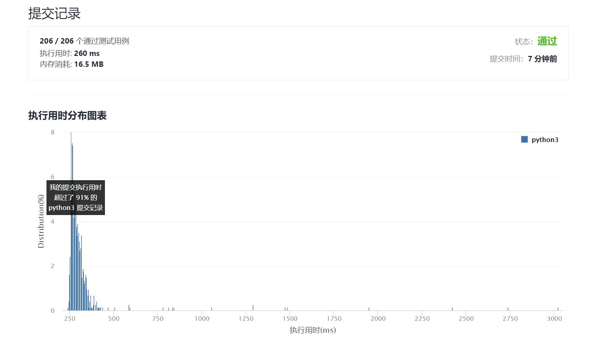

# 594-最长和谐子序列

Author：_Mumu

创建日期：2021/11/20

通过日期：2021/11/20

*****

踩过的坑：

1. 还以为是简单的动态规划，但实际上遍历一遍计数，再遍历一遍哈希表要更快

已解决：152/2432

*****

难度：简单

问题描述：

和谐数组是指一个数组里元素的最大值和最小值之间的差别 正好是 1 。

现在，给你一个整数数组 nums ，请你在所有可能的子序列中找到最长的和谐子序列的长度。

数组的子序列是一个由数组派生出来的序列，它可以通过删除一些元素或不删除元素、且不改变其余元素的顺序而得到。

 

示例 1：

输入：nums = [1,3,2,2,5,2,3,7]
输出：5
解释：最长的和谐子序列是 [3,2,2,2,3]
示例 2：

输入：nums = [1,2,3,4]
输出：2
示例 3：

输入：nums = [1,1,1,1]
输出：0

提示：

1 <= nums.length <= 2 * 104
-109 <= nums[i] <= 109

来源：力扣（LeetCode）
链接：https://leetcode-cn.com/problems/longest-harmonious-subsequence
