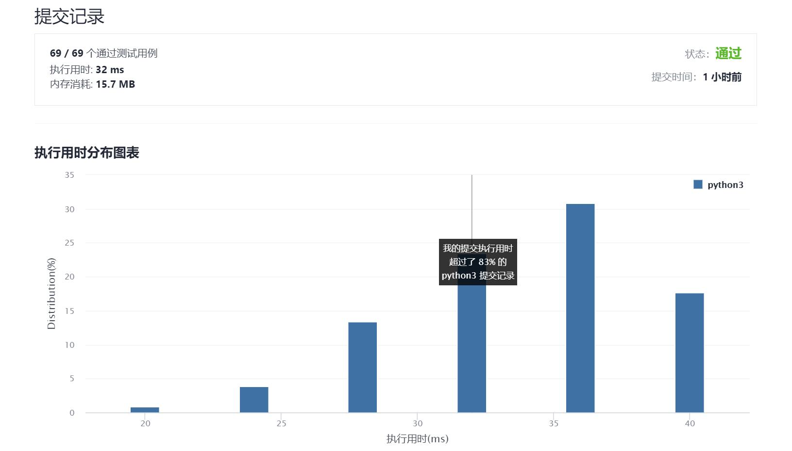

# 598-范围求和II

Author：_Mumu

创建日期：2021/11/07

通过日期：2021/11/07

*****

踩过的坑：

1. 简单简单
2. 没有打到卡，狠狠地心痛了

已解决：144/2420

*****

难度：简单

问题描述：

给定一个初始元素全部为 0，大小为 m*n 的矩阵 M 以及在 M 上的一系列更新操作。

操作用二维数组表示，其中的每个操作用一个含有两个正整数 a 和 b 的数组表示，含义是将所有符合 0 <= i < a 以及 0 <= j < b 的元素 M[i][j] 的值都增加 1。

在执行给定的一系列操作后，你需要返回矩阵中含有最大整数的元素个数。

示例 1:

输入: 
m = 3, n = 3
operations = [[2,2],[3,3]]
输出: 4
解释: 
初始状态, M = 
[[0, 0, 0],
 [0, 0, 0],
 [0, 0, 0]]

执行完操作 [2,2] 后, M = 
[[1, 1, 0],
 [1, 1, 0],
 [0, 0, 0]]

执行完操作 [3,3] 后, M = 
[[2, 2, 1],
 [2, 2, 1],
 [1, 1, 1]]

M 中最大的整数是 2, 而且 M 中有4个值为2的元素。因此返回 4。
注意:

m 和 n 的范围是 [1,40000]。
a 的范围是 [1,m]，b 的范围是 [1,n]。
操作数目不超过 10000。

来源：力扣（LeetCode）
链接：https://leetcode-cn.com/problems/range-addition-ii
