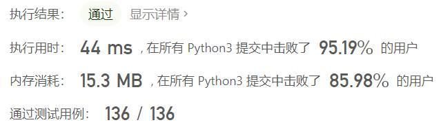
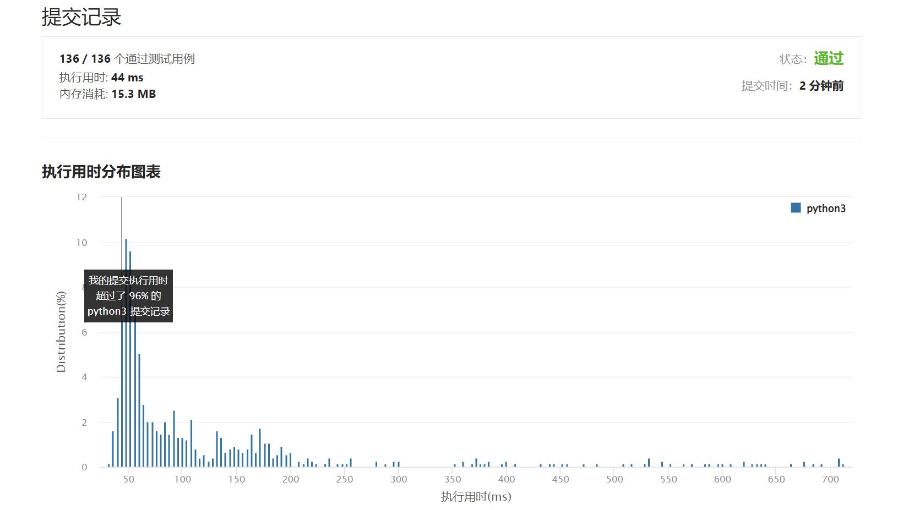

# 599-两个列表的最小索引总和

Author：_Mumu

创建日期：2022/03/14

通过日期：2022/03/14

*****

踩过的坑：

1. 轻松愉快
1. 确实没想到和题解一毛一样哦，还以为有双指针之类的更漂亮的做法

已解决：278/2558

*****

难度：简单

问题描述：

假设 Andy 和 Doris 想在晚餐时选择一家餐厅，并且他们都有一个表示最喜爱餐厅的列表，每个餐厅的名字用字符串表示。

你需要帮助他们用最少的索引和找出他们共同喜爱的餐厅。 如果答案不止一个，则输出所有答案并且不考虑顺序。 你可以假设答案总是存在。

 

示例 1:

输入: list1 = ["Shogun", "Tapioca Express", "Burger King", "KFC"]，list2 = ["Piatti", "The Grill at Torrey Pines", "Hungry Hunter Steakhouse", "Shogun"]
输出: ["Shogun"]
解释: 他们唯一共同喜爱的餐厅是“Shogun”。
示例 2:

输入:list1 = ["Shogun", "Tapioca Express", "Burger King", "KFC"]，list2 = ["KFC", "Shogun", "Burger King"]
输出: ["Shogun"]
解释: 他们共同喜爱且具有最小索引和的餐厅是“Shogun”，它有最小的索引和1(0+1)。

提示:

1 <= list1.length, list2.length <= 1000
1 <= list1[i].length, list2[i].length <= 30 
list1[i] 和 list2[i] 由空格 ' ' 和英文字母组成。
list1 的所有字符串都是 唯一 的。
list2 中的所有字符串都是 唯一 的。

来源：力扣（LeetCode）
链接：https://leetcode-cn.com/problems/minimum-index-sum-of-two-lists