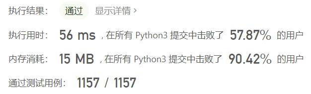
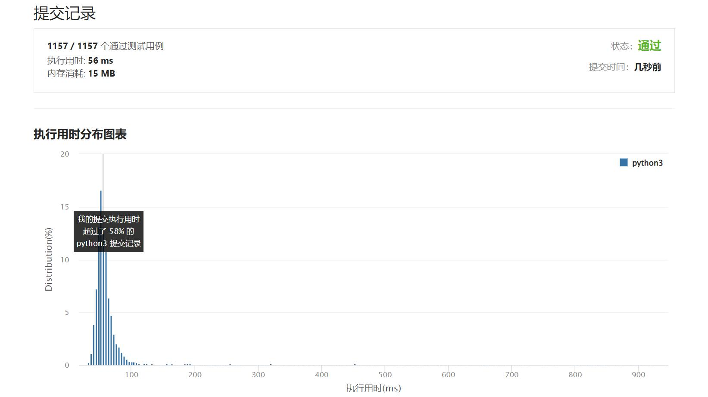

# 6-Z字形变换

Author：_Mumu

创建日期：2022/03/01

通过日期：2022/03/01

*****

踩过的坑：

1. 轻松愉快
1. 直接按规律一行一行构建即可

已解决：265/2543

*****

难度：中等

问题描述：

将一个给定字符串 s 根据给定的行数 numRows ，以从上往下、从左到右进行 Z 字形排列。

比如输入字符串为 "PAYPALISHIRING" 行数为 3 时，排列如下：

P   A   H   N
A P L S I I G
Y   I   R
之后，你的输出需要从左往右逐行读取，产生出一个新的字符串，比如："PAHNAPLSIIGYIR"。

请你实现这个将字符串进行指定行数变换的函数：

string convert(string s, int numRows);

示例 1：

输入：s = "PAYPALISHIRING", numRows = 3
输出："PAHNAPLSIIGYIR"
示例 2：
输入：s = "PAYPALISHIRING", numRows = 4
输出："PINALSIGYAHRPI"
解释：
P     I    N
A   L S  I G
Y A   H R
P     I
示例 3：

输入：s = "A", numRows = 1
输出："A"

提示：

1 <= s.length <= 1000
s 由英文字母（小写和大写）、',' 和 '.' 组成
1 <= numRows <= 1000

来源：力扣（LeetCode）
链接：https://leetcode-cn.com/problems/zigzag-conversion