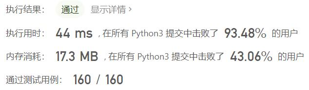
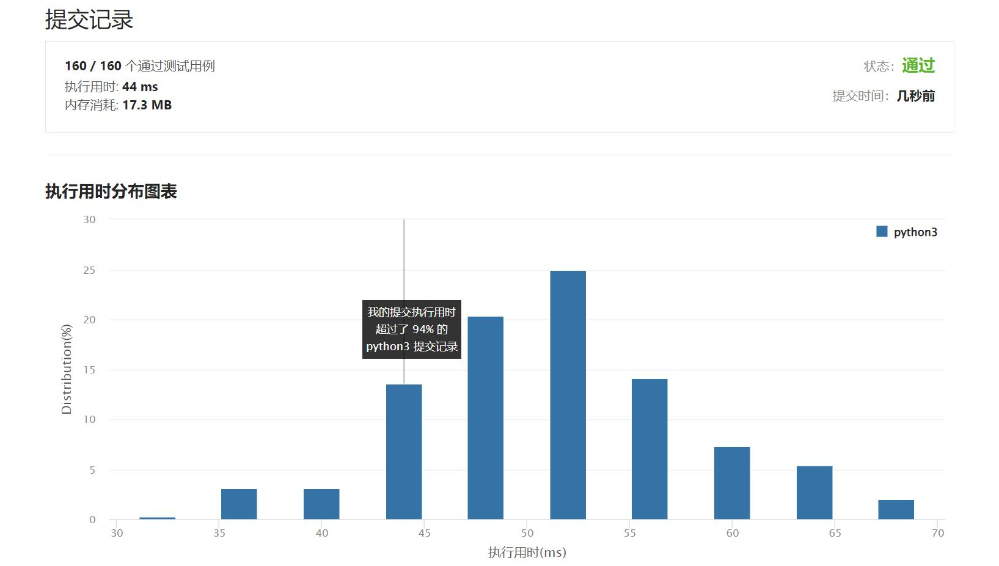

# 606-根据二叉树创建字符串

Author：_Mumu

创建日期：2022/03/19

通过日期：2022/03/19

*****

踩过的坑：

1. 轻松愉快

已解决：283/2559

*****

难度：简单

问题描述：

你需要采用前序遍历的方式，将一个二叉树转换成一个由括号和整数组成的字符串。

空节点则用一对空括号 "()" 表示。而且你需要省略所有不影响字符串与原始二叉树之间的一对一映射关系的空括号对。

示例 1:

输入: 二叉树: [1,2,3,4]
       1
     /   \
    2     3
   /    
  4     

输出: "1(2(4))(3)"

解释: 原本将是“1(2(4)())(3())”，
在你省略所有不必要的空括号对之后，
它将是“1(2(4))(3)”。
示例 2:

输入: 二叉树: [1,2,3,null,4]
       1
     /   \
    2     3
     \  
      4 

输出: "1(2()(4))(3)"

解释: 和第一个示例相似，
除了我们不能省略第一个对括号来中断输入和输出之间的一对一映射关系。

来源：力扣（LeetCode）
链接：https://leetcode-cn.com/problems/construct-string-from-binary-tree