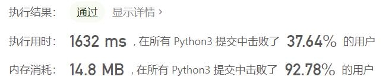

# 611-有效三角形的个数

Author：_Mumu

创建日期：2021/8/4

通过日期：2021/8/4

*****

踩过的坑：

1. 核心思路是双指针
2. 对于数组中的数字两两配对的，我们常常固定一个数字，然后用一个指针找到符合条件的边界
3. 本题要求三个数字匹配，我们可以同样固定一个数字，然后用一个指针来固定左边界，另一个指针来找到符合条件的右边界，完成计数
4. 当然，也许会被说成是固定两个数字，然后用一个指针来寻找边界
5. 但是本题的一个特征是，左边界右移时，右边界不可能左移，因此利用上一个左边界的信息计算下一个左边界所需要的右边界能够大大减少计算量，因此应当理解为双指针
6. 需要注意，右边界是否需要右移的条件必须写`k < n and nums[i] + nums[j] > nums[k]`而不能写`k < n - 1`，因为这样会导致两个条件判定得出的边界有误差，需要额外做判断，更加麻烦
7. 还有一个需要注意的是，虽然大部分情况下我们可以直接利用上一个左边界对应的右边界，但是有一个情况必须排除，即`k == j + 1`时直接不符合条件的情况，这时如果令`j = j + 1`而不改变`k`，将会出错

已解决：61/2299

*****

难度：中等

问题描述：

给定一个包含非负整数的数组，你的任务是统计其中可以组成三角形三条边的三元组个数。

示例 1:

输入: [2,2,3,4]
输出: 3
解释:
有效的组合是: 
2,3,4 (使用第一个 2)
2,3,4 (使用第二个 2)
2,2,3
注意:

数组长度不超过1000。
数组里整数的范围为 [0, 1000]。

来源：力扣（LeetCode）
链接：https://leetcode-cn.com/problems/valid-triangle-number