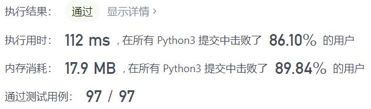
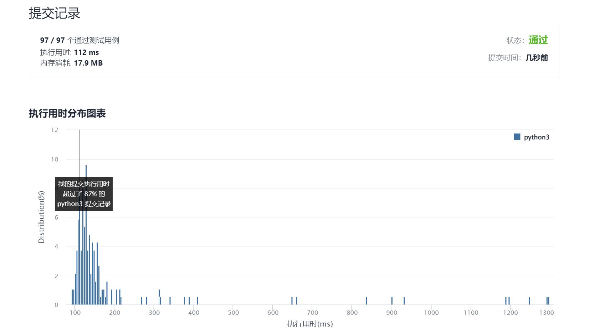

# 630-课程表III

Author：_Mumu

创建日期：2021/12/14

通过日期：2021/12/14

*****

踩过的坑：

1. 呜呜，又是看题解的一天
2. 看起来复杂的问题分析一通完却变得如此简单，太牛了
3. 希望我下次能学会自己分析
4. 主要是证明两个引理：①先学早结束的课总是对的；②下一门课能加入现有的学习方案的话就直接加，不能的话如果现有方案有时长更长的课就替换为下一门课，没有的话下一门课就不上了
5. 第一条是容易的，这决定了我们分析课程的顺序，第二条的第一点是容易的，能加就加，符合要求的上课最多原则，第二点在于即使不能加，也应当尽可能优化现有的学习方案，这一点可能不容易想到
6. 现在有一丢丢小兴奋紧张

已解决：176/2458

*****

难度：困难

问题描述：

这里有 n 门不同的在线课程，按从 1 到 n 编号。给你一个数组 courses ，其中 courses[i] = [durationi, lastDayi] 表示第 i 门课将会 持续 上 durationi 天课，并且必须在不晚于 lastDayi 的时候完成。

你的学期从第 1 天开始。且不能同时修读两门及两门以上的课程。

返回你最多可以修读的课程数目。

 

示例 1：

输入：courses = [[100, 200], [200, 1300], [1000, 1250], [2000, 3200]]
输出：3
解释：
这里一共有 4 门课程，但是你最多可以修 3 门：
首先，修第 1 门课，耗费 100 天，在第 100 天完成，在第 101 天开始下门课。
第二，修第 3 门课，耗费 1000 天，在第 1100 天完成，在第 1101 天开始下门课程。
第三，修第 2 门课，耗时 200 天，在第 1300 天完成。
第 4 门课现在不能修，因为将会在第 3300 天完成它，这已经超出了关闭日期。
示例 2：

输入：courses = [[1,2]]
输出：1
示例 3：

输入：courses = [[3,2],[4,3]]
输出：0

提示:

1 <= courses.length <= 104
1 <= durationi, lastDayi <= 104

来源：力扣（LeetCode）
链接：https://leetcode-cn.com/problems/course-schedule-iii
