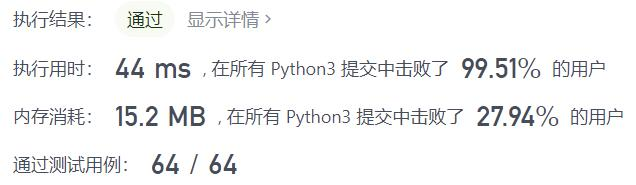
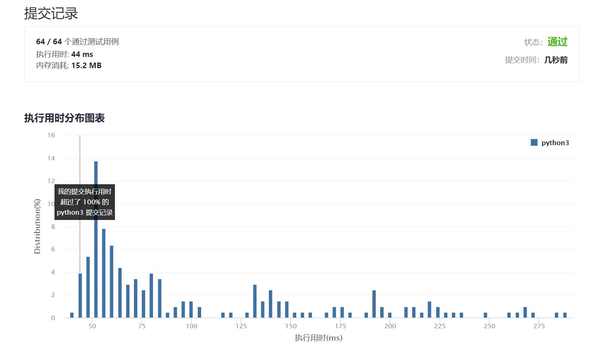

# 638-大礼包

Author：_Mumu

创建日期：2021/10/24

通过日期：2021/10/24

*****

踩过的坑：

1. 知道是动态规划但是却想不出来具体怎么操作
2. 本来以为要建一个$n$维的列表来存储各个状态，看了题解才知道原来可以先计算不买大礼包的价格，再用买大礼包的价格来更新最低价格
3. 还学习了妥善使用缓存机制的办法`@lru_cache(None)`，差不多是把函数作用于输入的变量上的值存储下来，下一次需要计算时直接从哈希表中提取结果，不必再计算一次，由于递归运算可能耗时较长，这个方法能够大大缩短运行时间
4. 此外，使用缓存时不可以将列表`list`作为函数的参数，因为列表unhashable，因此此时函数的输入必须使用可以hash的元组`tuple`

已解决：127/2405

*****

难度：中等

问题描述：

在 LeetCode 商店中， 有 n 件在售的物品。每件物品都有对应的价格。然而，也有一些大礼包，每个大礼包以优惠的价格捆绑销售一组物品。

给你一个整数数组 price 表示物品价格，其中 price[i] 是第 i 件物品的价格。另有一个整数数组 needs 表示购物清单，其中 needs[i] 是需要购买第 i 件物品的数量。

还有一个数组 special 表示大礼包，special[i] 的长度为 n + 1 ，其中 special[i][j] 表示第 i 个大礼包中内含第 j 件物品的数量，且 special[i][n] （也就是数组中的最后一个整数）为第 i 个大礼包的价格。

返回 确切 满足购物清单所需花费的最低价格，你可以充分利用大礼包的优惠活动。你不能购买超出购物清单指定数量的物品，即使那样会降低整体价格。任意大礼包可无限次购买。

 

示例 1：

输入：price = [2,5], special = [[3,0,5],[1,2,10]], needs = [3,2]
输出：14
解释：有 A 和 B 两种物品，价格分别为 ¥2 和 ¥5 。 
大礼包 1 ，你可以以 ¥5 的价格购买 3A 和 0B 。 
大礼包 2 ，你可以以 ¥10 的价格购买 1A 和 2B 。 
需要购买 3 个 A 和 2 个 B ， 所以付 ¥10 购买 1A 和 2B（大礼包 2），以及 ¥4 购买 2A 。
示例 2：

输入：price = [2,3,4], special = [[1,1,0,4],[2,2,1,9]], needs = [1,2,1]
输出：11
解释：A ，B ，C 的价格分别为 ¥2 ，¥3 ，¥4 。
可以用 ¥4 购买 1A 和 1B ，也可以用 ¥9 购买 2A ，2B 和 1C 。 
需要买 1A ，2B 和 1C ，所以付 ¥4 买 1A 和 1B（大礼包 1），以及 ¥3 购买 1B ， ¥4 购买 1C 。 
不可以购买超出待购清单的物品，尽管购买大礼包 2 更加便宜。

提示：

n == price.length
n == needs.length
1 <= n <= 6
0 <= price[i] <= 10
0 <= needs[i] <= 10
1 <= special.length <= 100
special[i].length == n + 1
0 <= special[i][j] <= 50

来源：力扣（LeetCode）
链接：https://leetcode-cn.com/problems/shopping-offers
