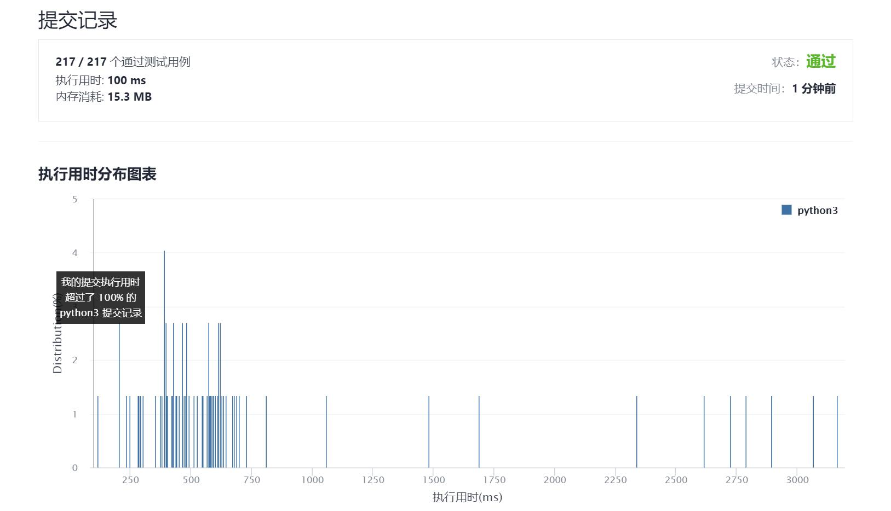

# 639-解码方法II

Author：_Mumu

创建日期：2021/9/27

通过日期：2021/9/27

*****

踩过的坑：

1. 蛮牛的，怎么就想不到利用动态规划递推呢
2. 一开始分类考虑各种情况然后把贡献值累加，最后再取模，耗时贼长
3. 然后看了一眼别人写的，可以分类后直接计算结果不必累加，并且计算过程中直接取模应该能使运行时间大大缩短，运行时间稳定100%，开心

已解决：99/2374

*****

难度：困难

问题描述：

一条包含字母 A-Z 的消息通过以下的方式进行了编码：

'A' -> 1
'B' -> 2
...
'Z' -> 26
要 解码 一条已编码的消息，所有的数字都必须分组，然后按原来的编码方案反向映射回字母（可能存在多种方式）。例如，"11106" 可以映射为：

"AAJF" 对应分组 (1 1 10 6)
"KJF" 对应分组 (11 10 6)
注意，像 (1 11 06) 这样的分组是无效的，因为 "06" 不可以映射为 'F' ，因为 "6" 与 "06" 不同。

除了 上面描述的数字字母映射方案，编码消息中可能包含 '*' 字符，可以表示从 '1' 到 '9' 的任一数字（不包括 '0'）。例如，编码字符串 "1*" 可以表示 "11"、"12"、"13"、"14"、"15"、"16"、"17"、"18" 或 "19" 中的任意一条消息。对 "1*" 进行解码，相当于解码该字符串可以表示的任何编码消息。

给你一个字符串 s ，由数字和 '*' 字符组成，返回 解码 该字符串的方法 数目 。

由于答案数目可能非常大，返回对 109 + 7 取余 的结果。

 

示例 1：

输入：s = "*"
输出：9
解释：这一条编码消息可以表示 "1"、"2"、"3"、"4"、"5"、"6"、"7"、"8" 或 "9" 中的任意一条。
可以分别解码成字符串 "A"、"B"、"C"、"D"、"E"、"F"、"G"、"H" 和 "I" 。
因此，"*" 总共有 9 种解码方法。
示例 2：

输入：s = "1*"
输出：18
解释：这一条编码消息可以表示 "11"、"12"、"13"、"14"、"15"、"16"、"17"、"18" 或 "19" 中的任意一条。
每种消息都可以由 2 种方法解码（例如，"11" 可以解码成 "AA" 或 "K"）。
因此，"1*" 共有 9 * 2 = 18 种解码方法。
示例 3：

输入：s = "2*"
输出：15
解释：这一条编码消息可以表示 "21"、"22"、"23"、"24"、"25"、"26"、"27"、"28" 或 "29" 中的任意一条。
"21"、"22"、"23"、"24"、"25" 和 "26" 由 2 种解码方法，但 "27"、"28" 和 "29" 仅有 1 种解码方法。
因此，"2*" 共有 (6 * 2) + (3 * 1) = 12 + 3 = 15 种解码方法。

提示：

1 <= s.length <= 105
s[i] 是 0 - 9 中的一位数字或字符 '*'

来源：力扣（LeetCode）
链接：https://leetcode-cn.com/problems/decode-ways-ii
