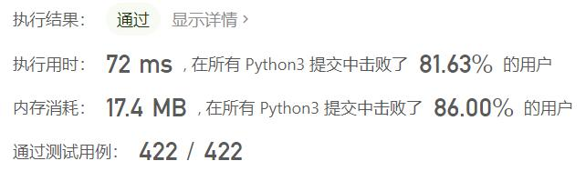
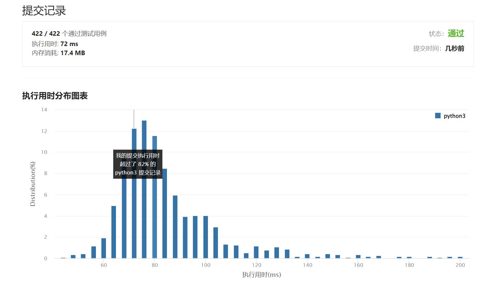

# 653-两数之和IV-输入BST

Author：_Mumu

创建日期：2022/03/21

通过日期：2022/03/21

*****

踩过的坑：

1. 轻松愉快

已解决：285/2568

*****

难度：简单

问题描述：

给定一个二叉搜索树 root 和一个目标结果 k，如果 BST 中存在两个元素且它们的和等于给定的目标结果，则返回 true。

 

示例 1：

输入: root = [5,3,6,2,4,null,7], k = 9
输出: true
示例 2：

输入: root = [5,3,6,2,4,null,7], k = 28
输出: false

提示:

二叉树的节点个数的范围是  [1, 104].
-104 <= Node.val <= 104
root 为二叉搜索树
-105 <= k <= 105

来源：力扣（LeetCode）
链接：https://leetcode-cn.com/problems/two-sum-iv-input-is-a-bst