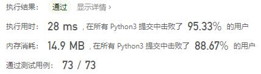
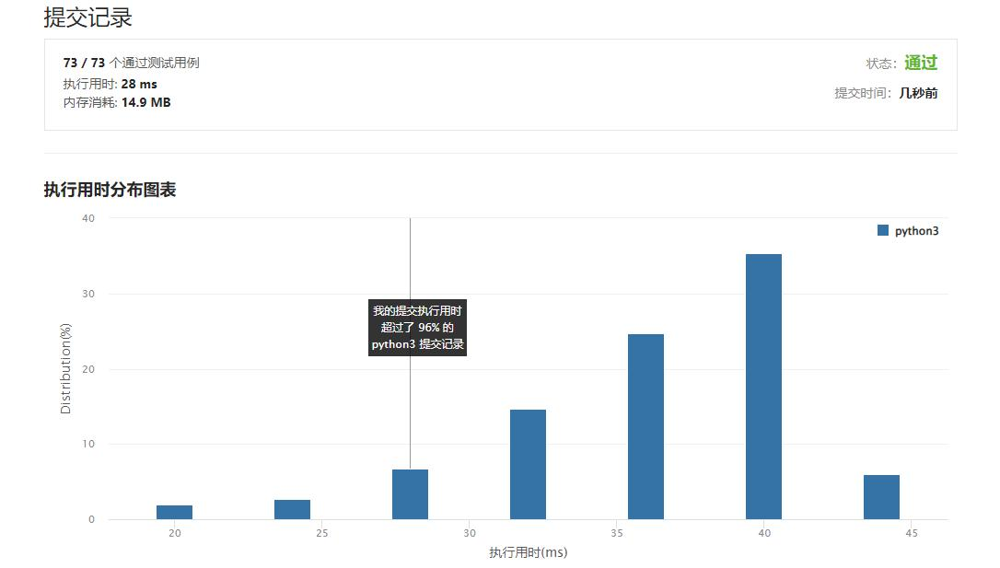

# 655-输出二叉树

Author：_Mumu

创建日期：2022/08/22

通过日期：2022/08/22

*****

踩过的坑：

1. 轻松愉快

已解决：439/2752

*****

难度：中等

问题描述：

给你一棵二叉树的根节点 root ，请你构造一个下标从 0 开始、大小为 m x n 的字符串矩阵 res ，用以表示树的 格式化布局 。构造此格式化布局矩阵需要遵循以下规则：

树的 高度 为 height ，矩阵的行数 m 应该等于 height + 1 。
矩阵的列数 n 应该等于 2height+1 - 1 。
根节点 需要放置在 顶行 的 正中间 ，对应位置为 res[0][(n-1)/2] 。
对于放置在矩阵中的每个节点，设对应位置为 res[r][c] ，将其左子节点放置在 res[r+1][c-2height-r-1] ，右子节点放置在 res[r+1][c+2height-r-1] 。
继续这一过程，直到树中的所有节点都妥善放置。
任意空单元格都应该包含空字符串 "" 。
返回构造得到的矩阵 res 。

 

 

示例 1：

输入：root = [1,2]
输出：
[["","1",""],
 ["2","",""]]
示例 2：

输入：root = [1,2,3,null,4]
输出：
[["","","","1","","",""],
 ["","2","","","","3",""],
 ["","","4","","","",""]]

提示：

树中节点数在范围 [1, 210] 内
-99 <= Node.val <= 99
树的深度在范围 [1, 10] 内

来源：力扣（LeetCode）
链接：https://leetcode.cn/problems/print-binary-tree