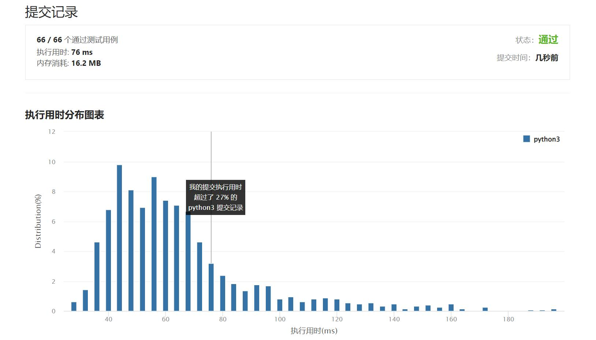

# 658-找到 K 个最接近的元素

Author：_Mumu

创建日期：2022/08/25

通过日期：2022/08/25

*****

踩过的坑：

1. 轻松愉快（指直接cv
1. 我知道二分法+双指针最快，但是指针更新的逻辑有点问题，看了题解豁然开朗

已解决：442/2752

*****

难度：中等

问题描述：

给定一个 排序好 的数组 arr ，两个整数 k 和 x ，从数组中找到最靠近 x（两数之差最小）的 k 个数。返回的结果必须要是按升序排好的。

整数 a 比整数 b 更接近 x 需要满足：

|a - x| < |b - x| 或者
|a - x| == |b - x| 且 a < b

示例 1：

输入：arr = [1,2,3,4,5], k = 4, x = 3
输出：[1,2,3,4]
示例 2：

输入：arr = [1,2,3,4,5], k = 4, x = -1
输出：[1,2,3,4]

提示：

1 <= k <= arr.length
1 <= arr.length <= 104
arr 按 升序 排列
-104 <= arr[i], x <= 104

来源：力扣（LeetCode）
链接：https://leetcode.cn/problems/find-k-closest-elements