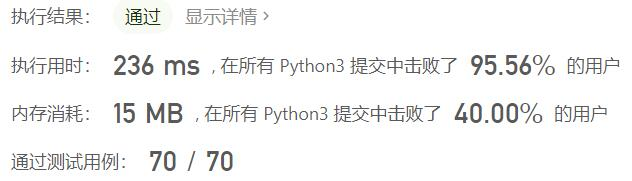
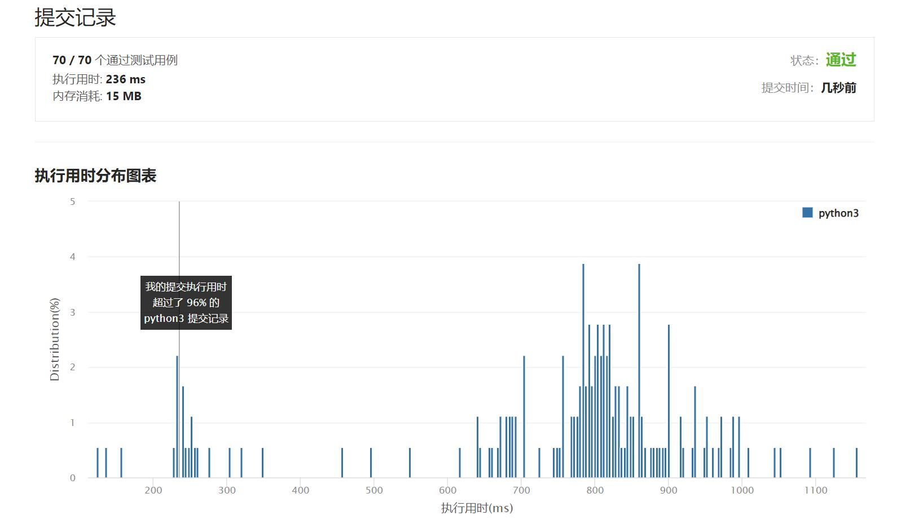

# 668-乘法表中第k小的数

Author：_Mumu

创建日期：2022/05/18

通过日期：2022/05/18

*****

踩过的坑：

1. 轻松愉快（指直接cv

已解决：343/2642

*****

难度：困难

问题描述：

几乎每一个人都用 乘法表。但是你能在乘法表中快速找到第k小的数字吗？

给定高度m 、宽度n 的一张 m * n的乘法表，以及正整数k，你需要返回表中第k 小的数字。

例 1：

输入: m = 3, n = 3, k = 5
输出: 3
解释: 
乘法表:
1	2	3
2	4	6
3	6	9

第5小的数字是 3 (1, 2, 2, 3, 3).
例 2：

输入: m = 2, n = 3, k = 6
输出: 6
解释: 
乘法表:
1	2	3
2	4	6

第6小的数字是 6 (1, 2, 2, 3, 4, 6).
注意：

m 和 n 的范围在 [1, 30000] 之间。
k 的范围在 [1, m * n] 之间。

来源：力扣（LeetCode）
链接：https://leetcode.cn/problems/kth-smallest-number-in-multiplication-table