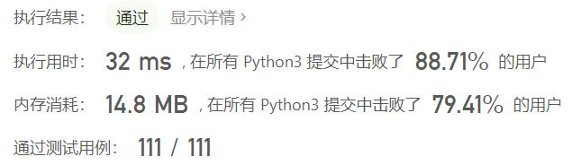
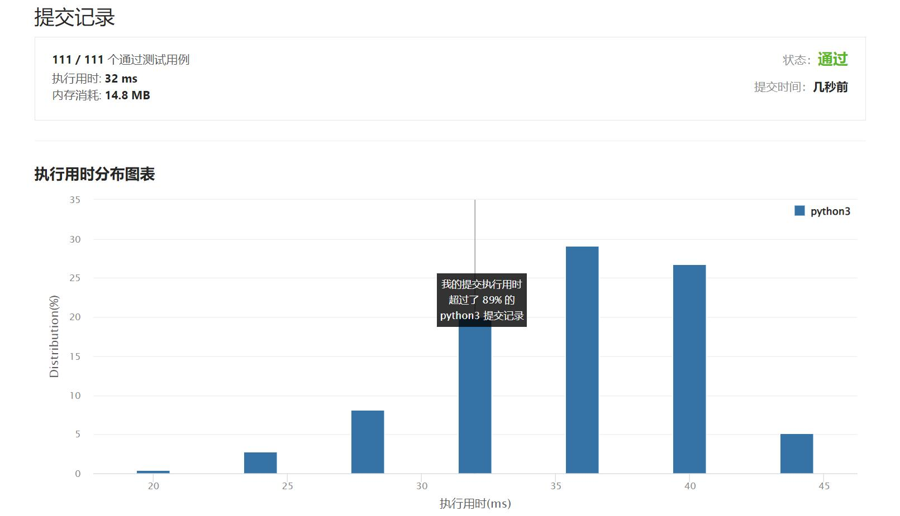

# 670-最大交换

Author：_Mumu

创建日期：2022/09/13

通过日期：2022/09/13

*****

踩过的坑：

1. 一开始的想法是从前往后找，然后跪了
1. 看题解才知道应该从后往前找最有效

已解决：461/2773

*****

难度：中等

问题描述：

给定一个非负整数，你至多可以交换一次数字中的任意两位。返回你能得到的最大值。

示例 1 :

输入: 2736
输出: 7236
解释: 交换数字2和数字7。
示例 2 :

输入: 9973
输出: 9973
解释: 不需要交换。
注意:

给定数字的范围是 [0, 108]

来源：力扣（LeetCode）
链接：https://leetcode.cn/problems/maximum-swap