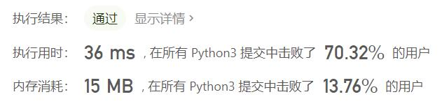
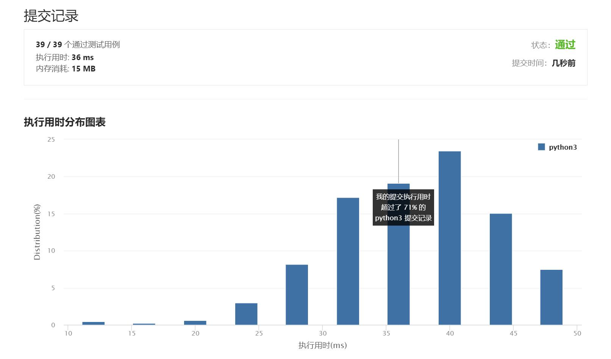

# 671-二叉树中第二小的节点

Author：_Mumu

创建日期：2021/7/27

通过日期：2021/7/27

*****

踩过的坑：

1. 虽然是简单题但也费了好多脑子
2. 最开始想的是深度优先递归遍历二叉树，用SortedList存储树中存在的值，结果通过时间和内存占用都5%
3. 看了题解才发现根本不用那么麻烦，不必把递归函数写成对象的方法，也不必使用SortedList，可以直接使用递归函数更新结果，也省去了一些多余的判断步骤，确实简洁明了

已解决：54/2174

*****

难度：简单

问题描述：

给定一个非空特殊的二叉树，每个节点都是正数，并且每个节点的子节点数量只能为 2 或 0。如果一个节点有两个子节点的话，那么该节点的值等于两个子节点中较小的一个。

更正式地说，root.val = min(root.left.val, root.right.val) 总成立。

给出这样的一个二叉树，你需要输出所有节点中的第二小的值。如果第二小的值不存在的话，输出 -1 。

 

示例 1：

输入：root = [2,2,5,null,null,5,7]
输出：5
解释：最小的值是 2 ，第二小的值是 5 。
示例 2：

输入：root = [2,2,2]
输出：-1
解释：最小的值是 2, 但是不存在第二小的值。

提示：

树中节点数目在范围 [1, 25] 内
1 <= Node.val <= 231 - 1
对于树中每个节点 root.val == min(root.left.val, root.right.val)

来源：力扣（LeetCode）
链接：https://leetcode-cn.com/problems/second-minimum-node-in-a-binary-tree