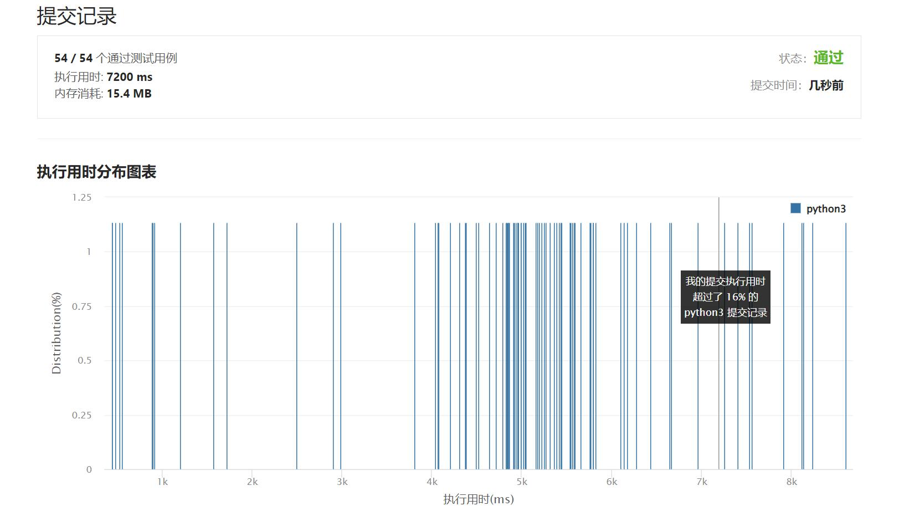

# 675-为高尔夫比赛砍树

Author：_Mumu

创建日期：2022/05/23

通过日期：2022/05/23

*****

踩过的坑：

1. 轻松愉快
1. 简单的广度优先搜索，没想到官解连A\*都出来了。。倒确实可以优化，但是A\*不是可能找到非最优解嘛。。虽然没有验证，可能移动代价相等的时候找到的永远是最优解？

已解决：348/2647

*****

难度：困难

问题描述：

你被请来给一个要举办高尔夫比赛的树林砍树。树林由一个 m x n 的矩阵表示， 在这个矩阵中：

0 表示障碍，无法触碰
1 表示地面，可以行走
比 1 大的数 表示有树的单元格，可以行走，数值表示树的高度
每一步，你都可以向上、下、左、右四个方向之一移动一个单位，如果你站的地方有一棵树，那么你可以决定是否要砍倒它。

你需要按照树的高度从低向高砍掉所有的树，每砍过一颗树，该单元格的值变为 1（即变为地面）。

你将从 (0, 0) 点开始工作，返回你砍完所有树需要走的最小步数。 如果你无法砍完所有的树，返回 -1 。

可以保证的是，没有两棵树的高度是相同的，并且你至少需要砍倒一棵树。

 

示例 1：

输入：forest = [[1,2,3],[0,0,4],[7,6,5]]
输出：6
解释：沿着上面的路径，你可以用 6 步，按从最矮到最高的顺序砍掉这些树。
示例 2：

输入：forest = [[1,2,3],[0,0,0],[7,6,5]]
输出：-1
解释：由于中间一行被障碍阻塞，无法访问最下面一行中的树。
示例 3：

输入：forest = [[2,3,4],[0,0,5],[8,7,6]]
输出：6
解释：可以按与示例 1 相同的路径来砍掉所有的树。
(0,0) 位置的树，可以直接砍去，不用算步数。

提示：

m == forest.length
n == forest[i].length
1 <= m, n <= 50
0 <= forest[i][j] <= 109

来源：力扣（LeetCode）
链接：https://leetcode.cn/problems/cut-off-trees-for-golf-event