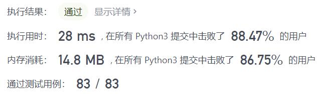
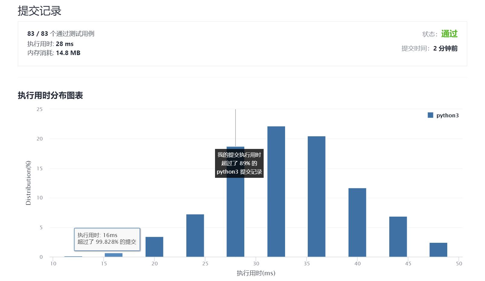

# 678-有效的括号字符串

Author：_Mumu

创建日期：2021/9/12

通过日期：2021/9/12

*****

踩过的坑：

1. “*”的存在让这题变得复杂了，于是我就不大会了
2. 我一开始想的是让“*”和“(”都进栈，但是之后的细节就搞不清楚了
3. 看了题解用两个栈分别存储就能解决我的问题，真帅
4. 方法三直接计数也太巧妙了，学习了

已解决：87/2351

*****

难度：中等

问题描述：

给定一个只包含三种字符的字符串：（ ，） 和 *，写一个函数来检验这个字符串是否为有效字符串。有效字符串具有如下规则：

任何左括号 ( 必须有相应的右括号 )。
任何右括号 ) 必须有相应的左括号 ( 。
左括号 ( 必须在对应的右括号之前 )。
* 可以被视为单个右括号 ) ，或单个左括号 ( ，或一个空字符串。
一个空字符串也被视为有效字符串。
示例 1:

输入: "()"
输出: True
示例 2:

输入: "(*)"
输出: True
示例 3:

输入: "(*))"
输出: True
注意:

字符串大小将在 [1，100] 范围内。

来源：力扣（LeetCode）
链接：https://leetcode-cn.com/problems/valid-parenthesis-string
