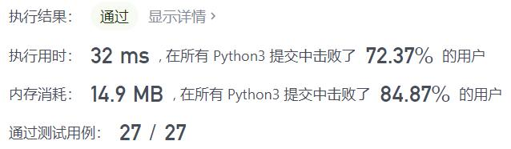
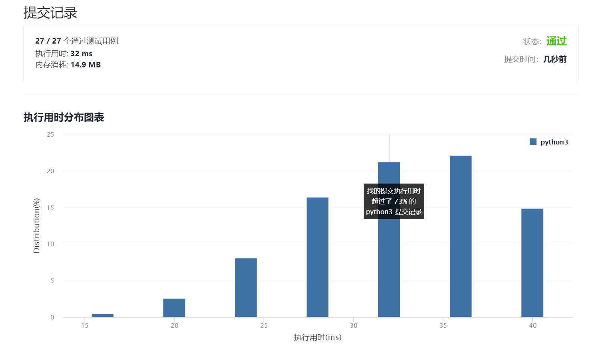

# 68-文本左右对齐

Author：_Mumu

创建日期：2021/9/9

通过日期：2021/9/9

*****

踩过的坑：

1. 按照题目说的解，其实还蛮容易的，一遍过了
2. 难点在于一行多个单词且空格数不能均等分配的时候，如何给前面的单词多分配一个空格
3. 我使用的是在循环中计数可分配的空格，这样可能会使算法比较慢，题解更巧妙，直接计算出需要多分配一个空格的间隙数量然后两端分别用`join`生成，最后再连接起来
4. 此外，我之前还新建了一个列表存储当前行的单词，但是看了题解才发现，可以直接用左右双指针标记当前行的单词在`words`中的位置，不必花费额外的空间
5. 这题应该主要困难在于繁琐的细节处理，思路还是十分简单的

已解决：85/2342

*****

难度：困难

问题描述：

给定一个单词数组和一个长度 maxWidth，重新排版单词，使其成为每行恰好有 maxWidth 个字符，且左右两端对齐的文本。

你应该使用“贪心算法”来放置给定的单词；也就是说，尽可能多地往每行中放置单词。必要时可用空格 ' ' 填充，使得每行恰好有 maxWidth 个字符。

要求尽可能均匀分配单词间的空格数量。如果某一行单词间的空格不能均匀分配，则左侧放置的空格数要多于右侧的空格数。

文本的最后一行应为左对齐，且单词之间不插入额外的空格。

说明:

单词是指由非空格字符组成的字符序列。
每个单词的长度大于 0，小于等于 maxWidth。
输入单词数组 words 至少包含一个单词。
示例:

输入:
words = ["This", "is", "an", "example", "of", "text", "justification."]
maxWidth = 16
输出:
[
   "This    is    an",
   "example  of text",
   "justification.  "
]
示例 2:

输入:
words = ["What","must","be","acknowledgment","shall","be"]
maxWidth = 16
输出:
[
  "What   must   be",
  "acknowledgment  ",
  "shall be        "
]
解释: 注意最后一行的格式应为 "shall be    " 而不是 "shall     be",
     因为最后一行应为左对齐，而不是左右两端对齐。       
     第二行同样为左对齐，这是因为这行只包含一个单词。
示例 3:

输入:
words = ["Science","is","what","we","understand","well","enough","to","explain",
         "to","a","computer.","Art","is","everything","else","we","do"]
maxWidth = 20
输出:
[
  "Science  is  what we",
  "understand      well",
  "enough to explain to",
  "a  computer.  Art is",
  "everything  else  we",
  "do                  "
]

来源：力扣（LeetCode）
链接：https://leetcode-cn.com/problems/text-justification
