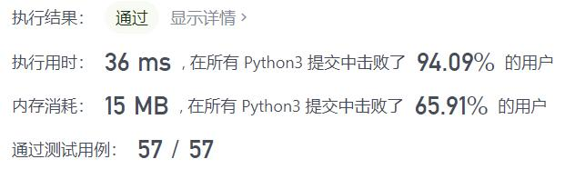
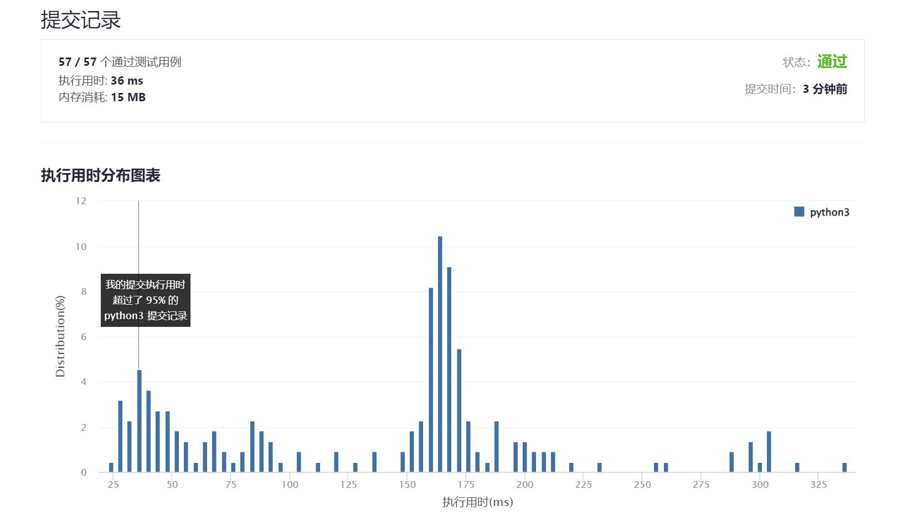

# 686-重复叠加字符串匹配

Author：_Mumu

创建日期：2021/12/22

通过日期：2021/12/22

*****

踩过的坑：

1. 轻松愉快！
2. 但题解的KMP算法好像很可怕。。

已解决：184/2467

*****

难度：中等

问题描述：

给定两个字符串 a 和 b，寻找重复叠加字符串 a 的最小次数，使得字符串 b 成为叠加后的字符串 a 的子串，如果不存在则返回 -1。

注意：字符串 "abc" 重复叠加 0 次是 ""，重复叠加 1 次是 "abc"，重复叠加 2 次是 "abcabc"。

 

示例 1：

输入：a = "abcd", b = "cdabcdab"
输出：3
解释：a 重复叠加三遍后为 "abcdabcdabcd", 此时 b 是其子串。
示例 2：

输入：a = "a", b = "aa"
输出：2
示例 3：

输入：a = "a", b = "a"
输出：1
示例 4：

输入：a = "abc", b = "wxyz"
输出：-1

提示：

1 <= a.length <= 104
1 <= b.length <= 104
a 和 b 由小写英文字母组成

来源：力扣（LeetCode）
链接：https://leetcode-cn.com/problems/repeated-string-match
