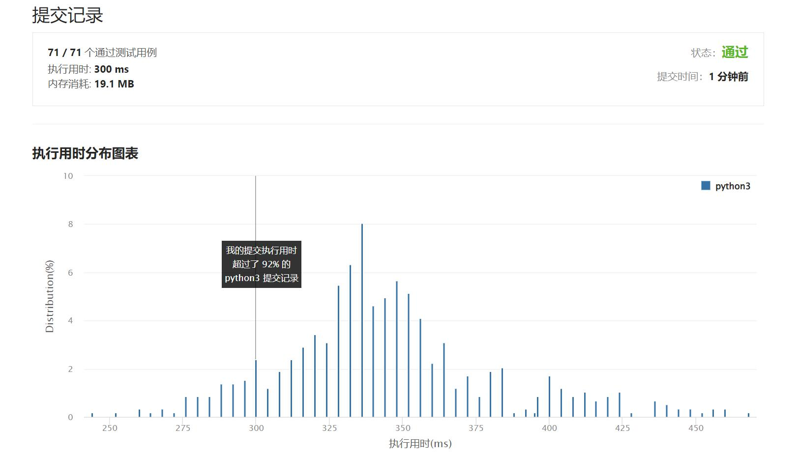

# 687-最长同值路径

Author：_Mumu

创建日期：2022/09/02

通过日期：2022/09/02

*****

踩过的坑：

1. 轻松愉快
1. 唯一难点在两侧路径合并，解决方法是dfs时只返回该节点单侧向下的最长路径长度，而在计算答案时使用两侧向下的最长路径长度相加来更新答案

已解决：450/2759

*****

难度：中等

问题描述：

给定一个二叉树的 root ，返回 最长的路径的长度 ，这个路径中的 每个节点具有相同值 。 这条路径可以经过也可以不经过根节点。

两个节点之间的路径长度 由它们之间的边数表示。

 

示例 1:

输入：root = [5,4,5,1,1,5]
输出：2
示例 2:

输入：root = [1,4,5,4,4,5]
输出：2

提示:

树的节点数的范围是 [0, 104] 
-1000 <= Node.val <= 1000
树的深度将不超过 1000 

来源：力扣（LeetCode）
链接：https://leetcode.cn/problems/longest-univalue-path