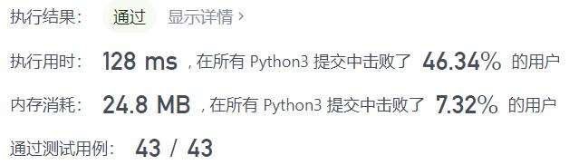
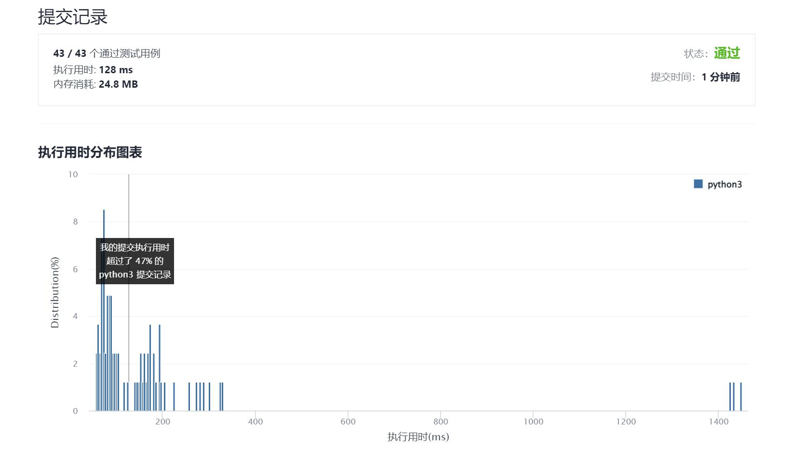

# 689-三个无重叠子数组的最大和

Author：_Mumu

创建日期：2021/12/08

通过日期：2021/12/08

*****

踩过的坑：

1. 难喔
2. 最开始暴力但显然超时了
3. 看题解三个滑动窗口，一时没有理解，看到方法2动态规划，就自己试了试，成功
4. 不过动态规划时间空间复杂度属实高了一些，时间复杂度$O(Cn)$，空间复杂度$O(C^2n)$，其中$C=3$为子数组数，也可能是我写得不太好
5. 三个滑动窗口其实也很好理解，三个窗口同时滑动，维护三个变量`sum1, sum2, sum3`实时记录当前各窗口数字和，维护三个变量`max_sum1, max_sum2, max_sum3`记录目前为止前1、2、3个窗口的总和，每次滑动使用`sum1`更新`max_sum1`，使用`max_sum1 + sum2`更新`max_sum2`，使用`max_sum2 + sum3`更新`max_sum3`，可以保证不会使最大值所取到的不同窗口有重叠，便可达到题目要求
6. 没有“遇到困难睡大觉”是挺好了啦，可是下次可不可以不要再“遇到困难看题解”啦

已解决：170/2449

*****

难度：困难

问题描述：

给你一个整数数组 nums 和一个整数 k ，找出三个长度为 k 、互不重叠、且 3 * k 项的和最大的子数组，并返回这三个子数组。

以下标的数组形式返回结果，数组中的每一项分别指示每个子数组的起始位置（下标从 0 开始）。如果有多个结果，返回字典序最小的一个。

 

示例 1：

输入：nums = [1,2,1,2,6,7,5,1], k = 2
输出：[0,3,5]
解释：子数组 [1, 2], [2, 6], [7, 5] 对应的起始下标为 [0, 3, 5]。
也可以取 [2, 1], 但是结果 [1, 3, 5] 在字典序上更大。
示例 2：

输入：nums = [1,2,1,2,1,2,1,2,1], k = 2
输出：[0,2,4]

提示：

1 <= nums.length <= 2 * 104
1 <= nums[i] < 216
1 <= k <= floor(nums.length / 3)

来源：力扣（LeetCode）
链接：https://leetcode-cn.com/problems/maximum-sum-of-3-non-overlapping-subarrays
