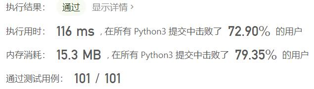
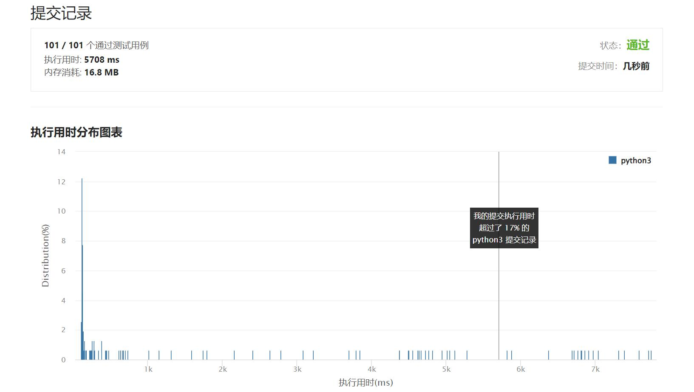

# 691-贴纸拼词

Author：_Mumu

创建日期：2022/05/14

通过日期：2022/05/14

*****

踩过的坑：

1. 轻松愉快（指直接cv
1. 啊，一看就知道这是个整数线性规划，但是作为代码题这么解就超时了555

已解决：339/2634

*****

难度：困难

问题描述：

我们有 n 种不同的贴纸。每个贴纸上都有一个小写的英文单词。

您想要拼写出给定的字符串 target ，方法是从收集的贴纸中切割单个字母并重新排列它们。如果你愿意，你可以多次使用每个贴纸，每个贴纸的数量是无限的。

返回你需要拼出 target 的最小贴纸数量。如果任务不可能，则返回 -1 。

注意：在所有的测试用例中，所有的单词都是从 1000 个最常见的美国英语单词中随机选择的，并且 target 被选择为两个随机单词的连接。

 

示例 1：

输入： stickers = ["with","example","science"], target = "thehat"
输出：3
解释：
我们可以使用 2 个 "with" 贴纸，和 1 个 "example" 贴纸。
把贴纸上的字母剪下来并重新排列后，就可以形成目标 “thehat“ 了。
此外，这是形成目标字符串所需的最小贴纸数量。
示例 2:

输入：stickers = ["notice","possible"], target = "basicbasic"
输出：-1
解释：我们不能通过剪切给定贴纸的字母来形成目标“basicbasic”。

提示:

n == stickers.length
1 <= n <= 50
1 <= stickers[i].length <= 10
1 <= target <= 15
stickers[i] 和 target 由小写英文单词组成

来源：力扣（LeetCode）
链接：https://leetcode.cn/problems/stickers-to-spell-word