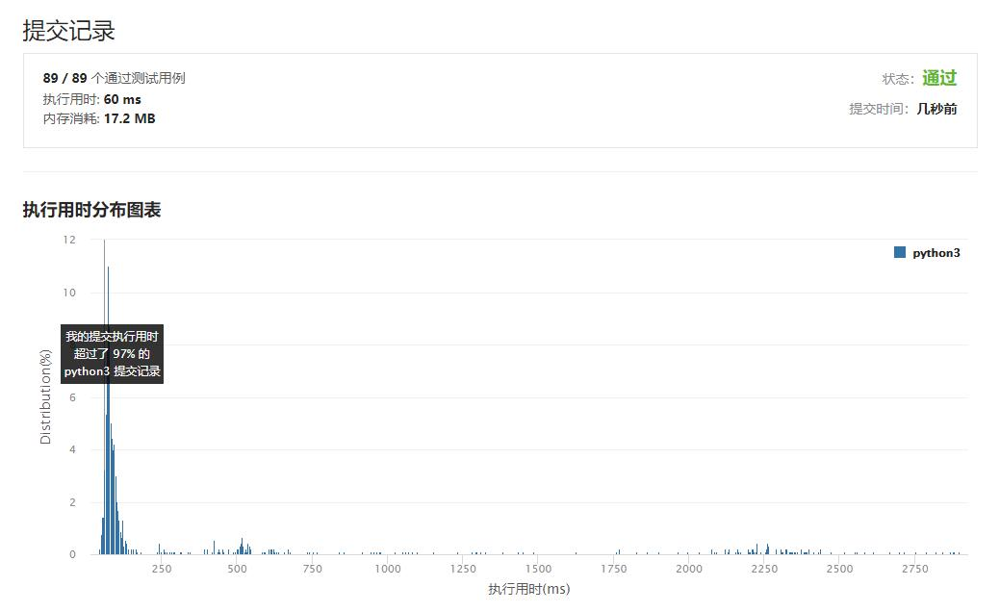

# 697-数组的度

Author：_Mumu

创建日期：2021/2/20

通过日期：2021/2/20

*****

踩过的坑：

1. 真没啥坑
2. 题解里提到了哈希表，确实比自己写的所用空间小

已解决：12/1982

*****

难度：简单

问题描述：

给定一个非空且只包含非负数的整数数组 nums，数组的度的定义是指数组里任一元素出现频数的最大值。

你的任务是在 nums 中找到与 nums 拥有相同大小的度的最短连续子数组，返回其长度。

 

示例 1：

输入：[1, 2, 2, 3, 1]
输出：2
解释：
输入数组的度是2，因为元素1和2的出现频数最大，均为2.
连续子数组里面拥有相同度的有如下所示:
[1, 2, 2, 3, 1], [1, 2, 2, 3], [2, 2, 3, 1], [1, 2, 2], [2, 2, 3], [2, 2]
最短连续子数组[2, 2]的长度为2，所以返回2.
示例 2：

输入：[1,2,2,3,1,4,2]
输出：6

提示：

nums.length 在1到 50,000 区间范围内。
nums[i] 是一个在 0 到 49,999 范围内的整数。

来源：力扣（LeetCode）
链接：https://leetcode-cn.com/problems/degree-of-an-array