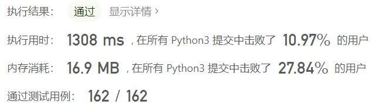
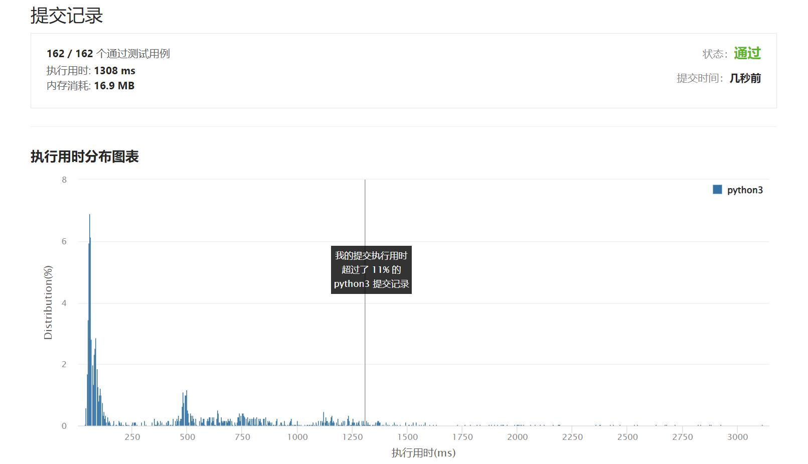

# 698-划分为k个相等的子集

Author：_Mumu

创建日期：2022/09/20

通过日期：2022/09/20

*****

踩过的坑：

1. 轻松愉快（指直接cv

已解决：468/2782

*****

难度：中等

问题描述：

给定一个整数数组  nums 和一个正整数 k，找出是否有可能把这个数组分成 k 个非空子集，其总和都相等。

 

示例 1：

输入： nums = [4, 3, 2, 3, 5, 2, 1], k = 4
输出： True
说明： 有可能将其分成 4 个子集（5），（1,4），（2,3），（2,3）等于总和。
示例 2:

输入: nums = [1,2,3,4], k = 3
输出: false

提示：

1 <= k <= len(nums) <= 16
0 < nums[i] < 10000
每个元素的频率在 [1,4] 范围内

来源：力扣（LeetCode）
链接：https://leetcode.cn/problems/partition-to-k-equal-sum-subsets