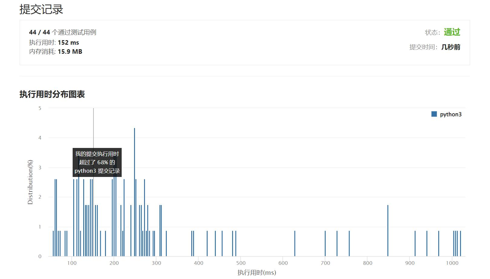

# 699-掉落的方块

Author：_Mumu

创建日期：2022/05/26

通过日期：2022/05/26

*****

踩过的坑：

1. 差不多就是个城市天际线问题，不过好处是方块范围内必然是最高可以直接处理掉范围内的所有点

已解决：351/2647

*****

难度：困难

问题描述：

在无限长的数轴（即 x 轴）上，我们根据给定的顺序放置对应的正方形方块。

第 i 个掉落的方块（positions[i] = (left, side_length)）是正方形，其中 left 表示该方块最左边的点位置(positions[i][0])，side_length 表示该方块的边长(positions[i][1])。

每个方块的底部边缘平行于数轴（即 x 轴），并且从一个比目前所有的落地方块更高的高度掉落而下。在上一个方块结束掉落，并保持静止后，才开始掉落新方块。

方块的底边具有非常大的粘性，并将保持固定在它们所接触的任何长度表面上（无论是数轴还是其他方块）。邻接掉落的边不会过早地粘合在一起，因为只有底边才具有粘性。

 

返回一个堆叠高度列表 ans 。每一个堆叠高度 ans[i] 表示在通过 positions[0], positions[1], ..., positions[i] 表示的方块掉落结束后，目前所有已经落稳的方块堆叠的最高高度。

 

 

示例 1:

输入: [[1, 2], [2, 3], [6, 1]]
输出: [2, 5, 5]
解释:

第一个方块 positions[0] = [1, 2] 掉落：
_aa
_aa
-------
方块最大高度为 2 。

第二个方块 positions[1] = [2, 3] 掉落：
__aaa
__aaa
__aaa
_aa__
_aa__
--------------
方块最大高度为5。
大的方块保持在较小的方块的顶部，不论它的重心在哪里，因为方块的底部边缘有非常大的粘性。

第三个方块 positions[1] = [6, 1] 掉落：
__aaa
__aaa
__aaa
_aa
_aa___a
-------------- 
方块最大高度为5。

因此，我们返回结果[2, 5, 5]。

示例 2:

输入: [[100, 100], [200, 100]]
输出: [100, 100]
解释: 相邻的方块不会过早地卡住，只有它们的底部边缘才能粘在表面上。

注意:

1 <= positions.length <= 1000.
1 <= positions[i][0] <= 10^8.
1 <= positions[i][1] <= 10^6.

来源：力扣（LeetCode）
链接：https://leetcode.cn/problems/falling-squares