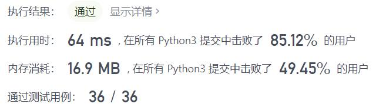
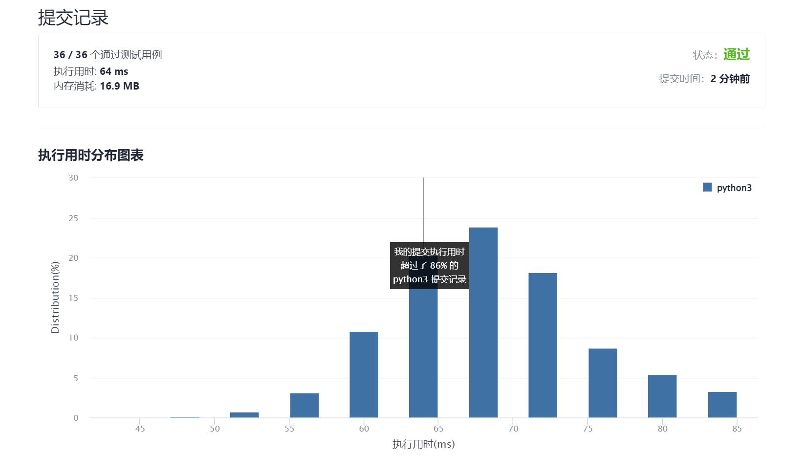

# 700-二叉搜索树中的搜索

Author：_Mumu

创建日期：2021/11/26

通过日期：2021/11/26

*****

踩过的坑：

1. 简单简单

已解决：158/2439

*****

难度：简单

问题描述：

给定二叉搜索树（BST）的根节点和一个值。 你需要在BST中找到节点值等于给定值的节点。 返回以该节点为根的子树。 如果节点不存在，则返回 NULL。

例如，

给定二叉搜索树:

        4
       / \
      2   7
     / \
    1   3

和值: 2
你应该返回如下子树:

      2     
     / \   
    1   3
在上述示例中，如果要找的值是 5，但因为没有节点值为 5，我们应该返回 NULL。

来源：力扣（LeetCode）
链接：https://leetcode-cn.com/problems/search-in-a-binary-search-tree
