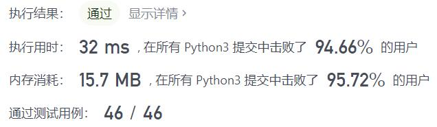
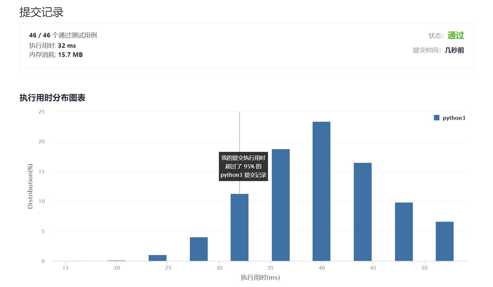

# 704-二分查找

Author：_Mumu

创建日期：2021/9/6

通过日期：2021/9/6

*****

踩过的坑：

1. 二分查找练了挺多遍的了
2. 不过有一个小细节，如果判断条件是`left < right`而不是`left < right - 1`的话，遇到目标不在数组中的情况会陷入死循环

已解决：80/2342

*****

难度：简单

问题描述：

给定一个 n 个元素有序的（升序）整型数组 nums 和一个目标值 target  ，写一个函数搜索 nums 中的 target，如果目标值存在返回下标，否则返回 -1。

示例 1:

输入: nums = [-1,0,3,5,9,12], target = 9
输出: 4
解释: 9 出现在 nums 中并且下标为 4
示例 2:

输入: nums = [-1,0,3,5,9,12], target = 2
输出: -1
解释: 2 不存在 nums 中因此返回 -1

提示：

你可以假设 nums 中的所有元素是不重复的。
n 将在 [1, 10000]之间。
nums 的每个元素都将在 [-9999, 9999]之间。

来源：力扣（LeetCode）
链接：https://leetcode-cn.com/problems/binary-search
