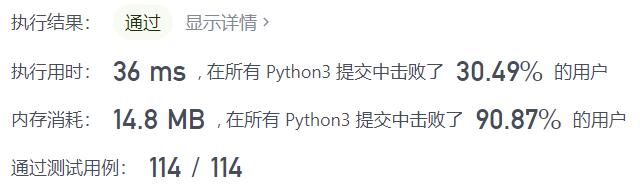
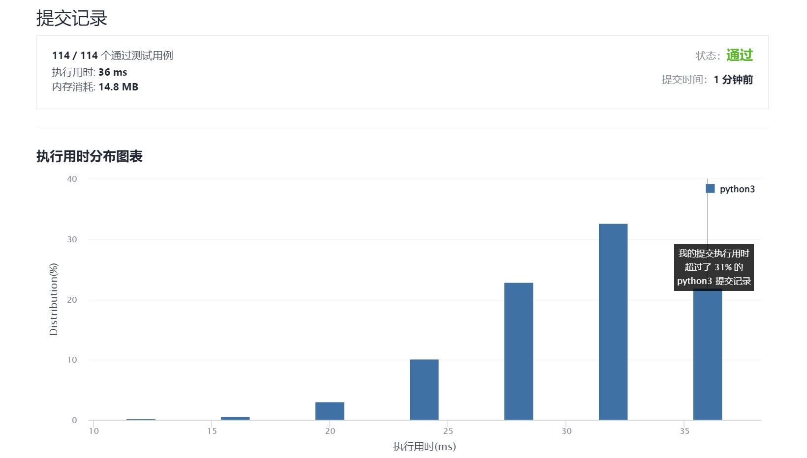

# 709-转换成小写字母

Author：_Mumu

创建日期：2021/12/12

通过日期：2021/12/12

*****

踩过的坑：

1. 轻松愉快！
2. 好家伙，原来转换大小写只要对ASCII码`asc`执行`asc | 32`就行了，牛啊
3. 学到了在生成句中的`if`里定义新变量的方式了`if 64 < (asc := ord(ch)) < 91 for ch in s`

已解决：174/2457

*****

难度：简单

问题描述：

给你一个字符串 s ，将该字符串中的大写字母转换成相同的小写字母，返回新的字符串。

 

示例 1：

输入：s = "Hello"
输出："hello"
示例 2：

输入：s = "here"
输出："here"
示例 3：

输入：s = "LOVELY"
输出："lovely"

提示：

1 <= s.length <= 100
s 由 ASCII 字符集中的可打印字符组成

来源：力扣（LeetCode）
链接：https://leetcode-cn.com/problems/to-lower-case
