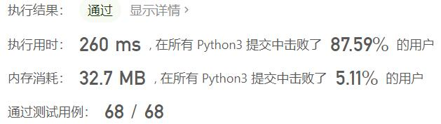
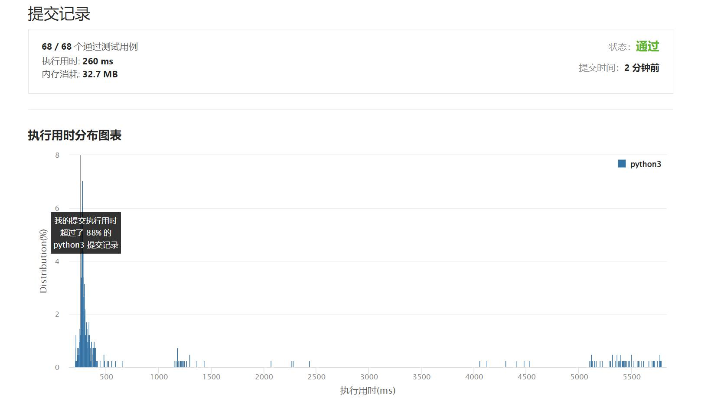

# 710-黑名单中的随机数

Author：_Mumu

创建日期：2022/06/26

通过日期：2022/06/26

*****

踩过的坑：

1. 轻松愉快
1. 有一说一，这不该是中等？

已解决：381/2688

*****

难度：困难

问题描述：

给定一个整数 n 和一个 无重复 黑名单整数数组 blacklist 。设计一种算法，从 [0, n - 1] 范围内的任意整数中选取一个 未加入 黑名单 blacklist 的整数。任何在上述范围内且不在黑名单 blacklist 中的整数都应该有 同等的可能性 被返回。

优化你的算法，使它最小化调用语言 内置 随机函数的次数。

实现 Solution 类:

Solution(int n, int[] blacklist) 初始化整数 n 和被加入黑名单 blacklist 的整数
int pick() 返回一个范围为 [0, n - 1] 且不在黑名单 blacklist 中的随机整数

示例 1：

输入
["Solution", "pick", "pick", "pick", "pick", "pick", "pick", "pick"]
[[7, [2, 3, 5]], [], [], [], [], [], [], []]
输出
[null, 0, 4, 1, 6, 1, 0, 4]

解释
Solution solution = new Solution(7, [2, 3, 5]);
solution.pick(); // 返回0，任何[0,1,4,6]的整数都可以。注意，对于每一个pick的调用，
                 // 0、1、4和6的返回概率必须相等(即概率为1/4)。
solution.pick(); // 返回 4
solution.pick(); // 返回 1
solution.pick(); // 返回 6
solution.pick(); // 返回 1
solution.pick(); // 返回 0
solution.pick(); // 返回 4

提示:

1 <= n <= 109
0 <= blacklist.length <= min(105, n - 1)
0 <= blacklist[i] < n
blacklist 中所有值都 不同
 pick 最多被调用 2 * 104 次

来源：力扣（LeetCode）
链接：https://leetcode.cn/problems/random-pick-with-blacklist