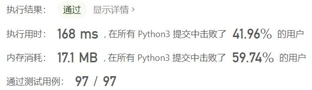
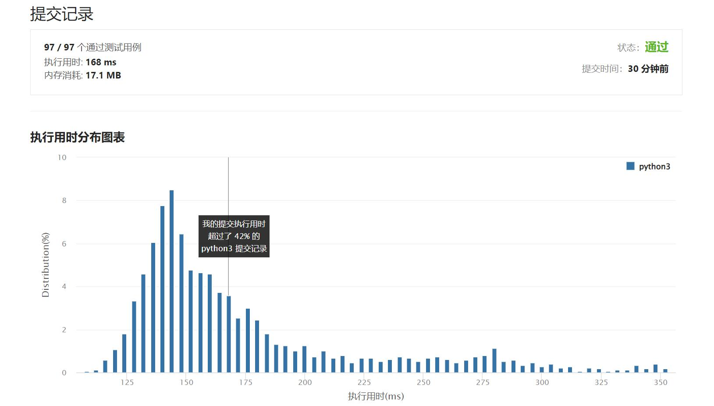

# 713-乘积小于 K 的子数组

Author：_Mumu

创建日期：2022/05/05

通过日期：2022/05/05

*****

踩过的坑：

1. 轻松愉快（指直接cv
1. 学到了，滑动窗口固定右端点

已解决：330/2629

*****

难度：中等

问题描述：

给你一个整数数组 nums 和一个整数 k ，请你返回子数组内所有元素的乘积严格小于 k 的连续子数组的数目。

示例 1：

输入：nums = [10,5,2,6], k = 100
输出：8
解释：8 个乘积小于 100 的子数组分别为：[10]、[5]、[2],、[6]、[10,5]、[5,2]、[2,6]、[5,2,6]。
需要注意的是 [10,5,2] 并不是乘积小于 100 的子数组。
示例 2：

输入：nums = [1,2,3], k = 0
输出：0

提示: 

1 <= nums.length <= 3 * 104
1 <= nums[i] <= 1000
0 <= k <= 106

来源：力扣（LeetCode）
链接：https://leetcode-cn.com/problems/subarray-product-less-than-k