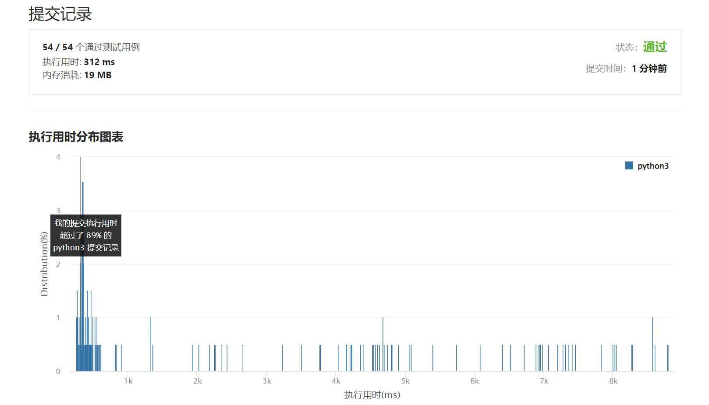

# 715-Range模块

Author：_Mumu

创建日期：2022/06/20

通过日期：2022/06/20

*****

踩过的坑：

1. 轻松愉快（指遇到困难睡大觉
1. 真的很讨厌写区间处理，不过有个大佬写的真的赏心悦目

已解决：375/2678

*****

难度：困难

问题描述：

Range模块是跟踪数字范围的模块。设计一个数据结构来跟踪表示为 半开区间 的范围并查询它们。

半开区间 [left, right) 表示所有 left <= x < right 的实数 x 。

实现 RangeModule 类:

RangeModule() 初始化数据结构的对象。
void addRange(int left, int right) 添加 半开区间 [left, right)，跟踪该区间中的每个实数。添加与当前跟踪的数字部分重叠的区间时，应当添加在区间 [left, right) 中尚未跟踪的任何数字到该区间中。
boolean queryRange(int left, int right) 只有在当前正在跟踪区间 [left, right) 中的每一个实数时，才返回 true ，否则返回 false 。
void removeRange(int left, int right) 停止跟踪 半开区间 [left, right) 中当前正在跟踪的每个实数。

示例 1：

输入
["RangeModule", "addRange", "removeRange", "queryRange", "queryRange", "queryRange"]
[[], [10, 20], [14, 16], [10, 14], [13, 15], [16, 17]]
输出
[null, null, null, true, false, true]

解释
RangeModule rangeModule = new RangeModule();
rangeModule.addRange(10, 20);
rangeModule.removeRange(14, 16);
rangeModule.queryRange(10, 14); 返回 true （区间 [10, 14) 中的每个数都正在被跟踪）
rangeModule.queryRange(13, 15); 返回 false（未跟踪区间 [13, 15) 中像 14, 14.03, 14.17 这样的数字）
rangeModule.queryRange(16, 17); 返回 true （尽管执行了删除操作，区间 [16, 17) 中的数字 16 仍然会被跟踪）

提示：

1 <= left < right <= 109
在单个测试用例中，对 addRange 、  queryRange 和 removeRange 的调用总数不超过 104 次

来源：力扣（LeetCode）
链接：https://leetcode.cn/problems/range-module