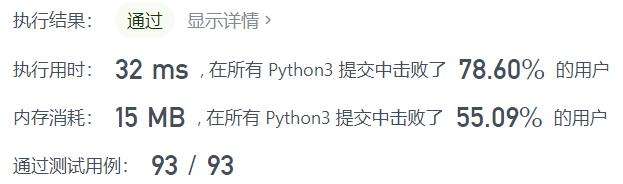
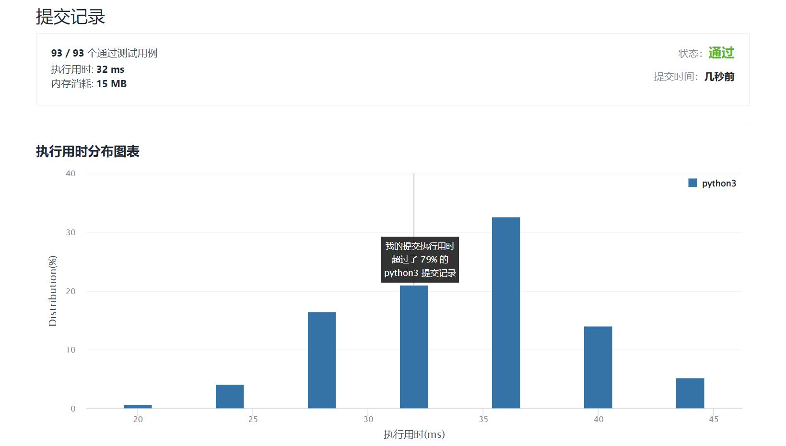

# 717-1比特与2比特字符

Author：_Mumu

创建日期：2022/02/20

通过日期：2022/02/20

*****

踩过的坑：

1. 轻松愉快
2. 0一定是字符的结尾，那么只要统计最后一位0与前一个0（可能不存在）之间1的数量即可
3. 如果1的个数为偶数，那么最后一位0必然单独成为一个字符
4. 如果是奇数，那么最后一位0必然和前一个1组成一个二位字符
5. 这个应该类比霍夫曼编码

已解决：258/2534

*****

难度：简单

问题描述：

有两种特殊字符：

第一种字符可以用一个比特 0 来表示
第二种字符可以用两个比特(10 或 11)来表示、
给定一个以 0 结尾的二进制数组 bits ，如果最后一个字符必须是一位字符，则返回 true 。

 

示例 1:

输入: bits = [1, 0, 0]
输出: true
解释: 唯一的编码方式是一个两比特字符和一个一比特字符。
所以最后一个字符是一比特字符。
示例 2:

输入: bits = [1, 1, 1, 0]
输出: false
解释: 唯一的编码方式是两比特字符和两比特字符。
所以最后一个字符不是一比特字符。

提示:

1 <= bits.length <= 1000
bits[i] == 0 or 1

来源：力扣（LeetCode）
链接：https://leetcode-cn.com/problems/1-bit-and-2-bit-characters
