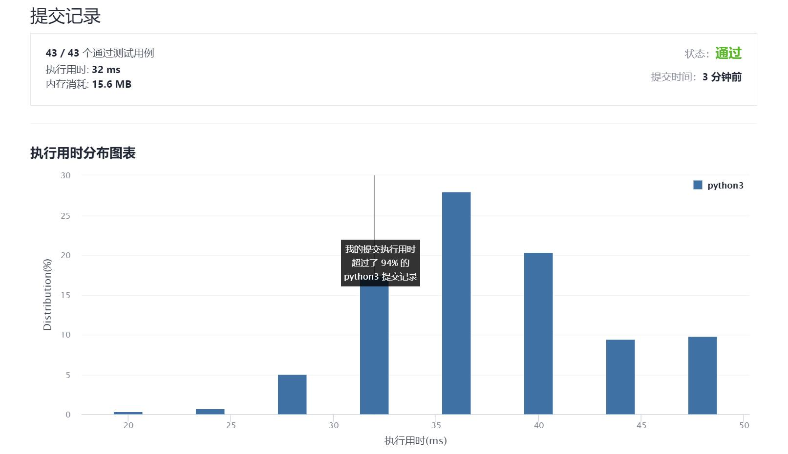

# 725-分隔链表

Author：_Mumu

创建日期：2021/9/22

通过日期：2021/9/22

*****

踩过的坑：

1. 两次遍历
2. 一次计算长度，第二次直接按顺序取分割后的链表头并让尾指向空指针

已解决：96/2363

*****

难度：中等

问题描述：

给你一个头结点为 head 的单链表和一个整数 k ，请你设计一个算法将链表分隔为 k 个连续的部分。

每部分的长度应该尽可能的相等：任意两部分的长度差距不能超过 1 。这可能会导致有些部分为 null 。

这 k 个部分应该按照在链表中出现的顺序排列，并且排在前面的部分的长度应该大于或等于排在后面的长度。

返回一个由上述 k 部分组成的数组。

示例 1：

输入：head = [1,2,3], k = 5
输出：[[1],[2],[3],[],[]]
解释：
第一个元素 output[0] 为 output[0].val = 1 ，output[0].next = null 。
最后一个元素 output[4] 为 null ，但它作为 ListNode 的字符串表示是 [] 。
示例 2：

输入：head = [1,2,3,4,5,6,7,8,9,10], k = 3
输出：[[1,2,3,4],[5,6,7],[8,9,10]]
解释：
输入被分成了几个连续的部分，并且每部分的长度相差不超过 1 。前面部分的长度大于等于后面部分的长度。

提示：

链表中节点的数目在范围 [0, 1000]
0 <= Node.val <= 1000
1 <= k <= 50

来源：力扣（LeetCode）
链接：https://leetcode-cn.com/problems/split-linked-list-in-parts
