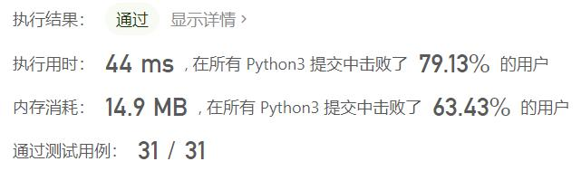
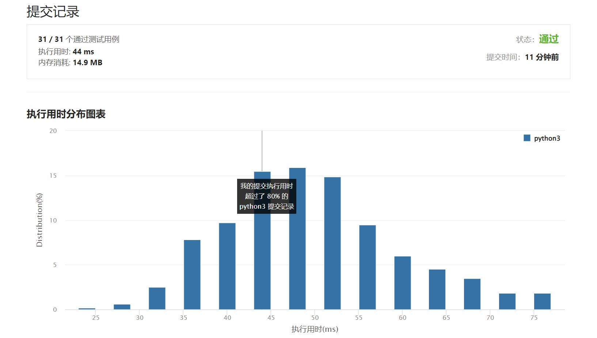

# 728-自除数

Author：_Mumu

创建日期：2022/03/31

通过日期：2022/03/31

*****

踩过的坑：

1. 轻松愉快

已解决：295/2573

*****

难度：简单

问题描述：

自除数 是指可以被它包含的每一位数整除的数。

例如，128 是一个 自除数 ，因为 128 % 1 == 0，128 % 2 == 0，128 % 8 == 0。
自除数 不允许包含 0 。

给定两个整数 left 和 right ，返回一个列表，列表的元素是范围 [left, right] 内所有的 自除数 。

 

示例 1：

输入：left = 1, right = 22
输出：[1, 2, 3, 4, 5, 6, 7, 8, 9, 11, 12, 15, 22]
示例 2:

输入：left = 47, right = 85
输出：[48,55,66,77]

提示：

1 <= left <= right <= 104

来源：力扣（LeetCode）
链接：https://leetcode-cn.com/problems/self-dividing-numbers