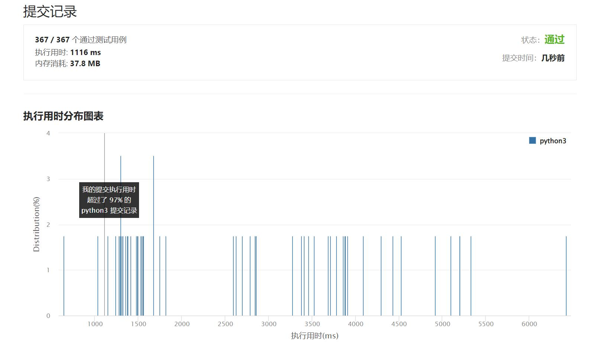

# 730-统计不同回文子序列

Author：_Mumu

创建日期：2022/06/10

通过日期：2022/06/10

*****

踩过的坑：

1. 轻松愉快（指直接cv

已解决：366/2663

*****

难度：困难

问题描述：

给定一个字符串 s，返回 s 中不同的非空「回文子序列」个数 。

通过从 s 中删除 0 个或多个字符来获得子序列。

如果一个字符序列与它反转后的字符序列一致，那么它是「回文字符序列」。

如果有某个 i , 满足 ai != bi ，则两个序列 a1, a2, ... 和 b1, b2, ... 不同。

注意：

结果可能很大，你需要对 109 + 7 取模 。

示例 1：

输入：s = 'bccb'
输出：6
解释：6 个不同的非空回文子字符序列分别为：'b', 'c', 'bb', 'cc', 'bcb', 'bccb'。
注意：'bcb' 虽然出现两次但仅计数一次。
示例 2：

输入：s = 'abcdabcdabcdabcdabcdabcdabcdabcddcbadcbadcbadcbadcbadcbadcbadcba'
输出：104860361
解释：共有 3104860382 个不同的非空回文子序列，104860361 对 109 + 7 取模后的值。

提示：

1 <= s.length <= 1000
s[i] 仅包含 'a', 'b', 'c' 或 'd' 

来源：力扣（LeetCode）
链接：https://leetcode.cn/problems/count-different-palindromic-subsequences