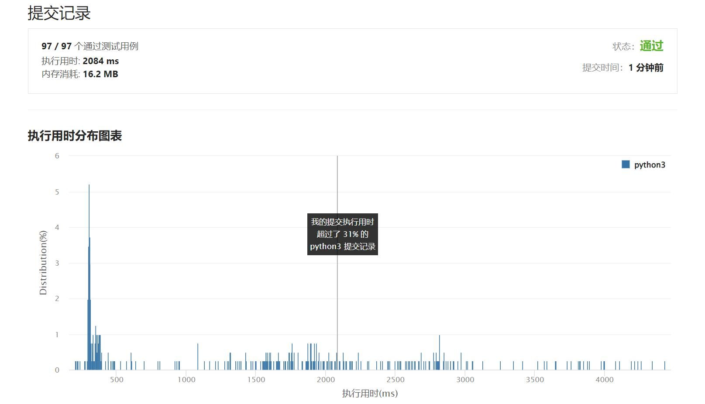

# 731-我的日程安排表II

Author：_Mumu

创建日期：2022/07/19

通过日期：2022/07/19

*****

踩过的坑：

1. 轻松愉快（指直接cv

已解决：405/2710

*****

难度：中等

问题描述：

实现一个 MyCalendar 类来存放你的日程安排。如果要添加的时间内不会导致三重预订时，则可以存储这个新的日程安排。

MyCalendar 有一个 book(int start, int end)方法。它意味着在 start 到 end 时间内增加一个日程安排，注意，这里的时间是半开区间，即 [start, end), 实数 x 的范围为，  start <= x < end。

当三个日程安排有一些时间上的交叉时（例如三个日程安排都在同一时间内），就会产生三重预订。

每次调用 MyCalendar.book方法时，如果可以将日程安排成功添加到日历中而不会导致三重预订，返回 true。否则，返回 false 并且不要将该日程安排添加到日历中。

请按照以下步骤调用MyCalendar 类: MyCalendar cal = new MyCalendar(); MyCalendar.book(start, end)

 

示例：

MyCalendar();
MyCalendar.book(10, 20); // returns true
MyCalendar.book(50, 60); // returns true
MyCalendar.book(10, 40); // returns true
MyCalendar.book(5, 15); // returns false
MyCalendar.book(5, 10); // returns true
MyCalendar.book(25, 55); // returns true
解释： 
前两个日程安排可以添加至日历中。 第三个日程安排会导致双重预订，但可以添加至日历中。
第四个日程安排活动（5,15）不能添加至日历中，因为它会导致三重预订。
第五个日程安排（5,10）可以添加至日历中，因为它未使用已经双重预订的时间10。
第六个日程安排（25,55）可以添加至日历中，因为时间 [25,40] 将和第三个日程安排双重预订；
时间 [40,50] 将单独预订，时间 [50,55）将和第二个日程安排双重预订。

提示：

每个测试用例，调用 MyCalendar.book 函数最多不超过 1000次。
调用函数 MyCalendar.book(start, end)时， start 和 end 的取值范围为 [0, 10^9]。

来源：力扣（LeetCode）
链接：https://leetcode.cn/problems/my-calendar-ii