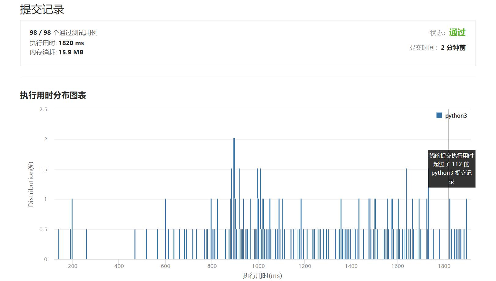

# 732-我的日程安排表III

Author：_Mumu

创建日期：2022/06/06

通过日期：2022/06/06

*****

踩过的坑：

1. 轻松愉快（指直接cv
1. `dict.setdefault(key, default_value)`真好用

已解决：362/2662

*****

难度：困难

问题描述：

当 k 个日程安排有一些时间上的交叉时（例如 k 个日程安排都在同一时间内），就会产生 k 次预订。

给你一些日程安排 [start, end) ，请你在每个日程安排添加后，返回一个整数 k ，表示所有先前日程安排会产生的最大 k 次预订。

实现一个 MyCalendarThree 类来存放你的日程安排，你可以一直添加新的日程安排。

MyCalendarThree() 初始化对象。
int book(int start, int end) 返回一个整数 k ，表示日历中存在的 k 次预订的最大值。

示例：

输入：
["MyCalendarThree", "book", "book", "book", "book", "book", "book"]
[[], [10, 20], [50, 60], [10, 40], [5, 15], [5, 10], [25, 55]]
输出：
[null, 1, 1, 2, 3, 3, 3]

解释：
MyCalendarThree myCalendarThree = new MyCalendarThree();
myCalendarThree.book(10, 20); // 返回 1 ，第一个日程安排可以预订并且不存在相交，所以最大 k 次预订是 1 次预订。
myCalendarThree.book(50, 60); // 返回 1 ，第二个日程安排可以预订并且不存在相交，所以最大 k 次预订是 1 次预订。
myCalendarThree.book(10, 40); // 返回 2 ，第三个日程安排 [10, 40) 与第一个日程安排相交，所以最大 k 次预订是 2 次预订。
myCalendarThree.book(5, 15); // 返回 3 ，剩下的日程安排的最大 k 次预订是 3 次预订。
myCalendarThree.book(5, 10); // 返回 3
myCalendarThree.book(25, 55); // 返回 3

提示：

0 <= start < end <= 109
每个测试用例，调用 book 函数最多不超过 400次

来源：力扣（LeetCode）
链接：https://leetcode.cn/problems/my-calendar-iii