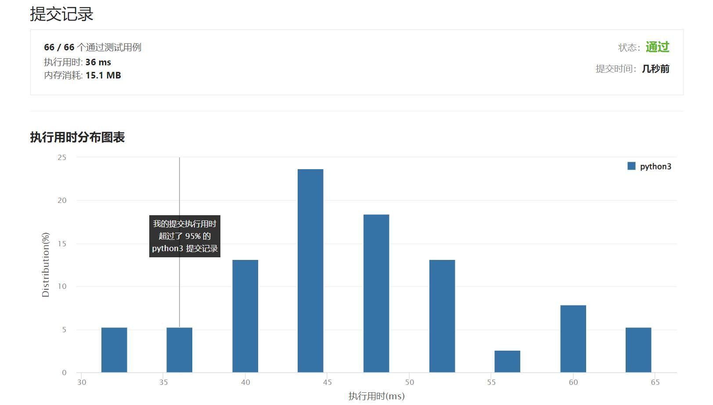

# 736-Lisp语法解析

Author：_Mumu

创建日期：2022/07/06

通过日期：2022/07/06

*****

踩过的坑：

1. 轻松愉快（指直接cv

已解决：392/2695

*****

难度：困难

问题描述：

给你一个类似 Lisp 语句的字符串表达式 expression，求出其计算结果。

表达式语法如下所示:

表达式可以为整数，let 表达式，add 表达式，mult 表达式，或赋值的变量。表达式的结果总是一个整数。
(整数可以是正整数、负整数、0)
let 表达式采用 "(let v1 e1 v2 e2 ... vn en expr)" 的形式，其中 let 总是以字符串 "let"来表示，接下来会跟随一对或多对交替的变量和表达式，也就是说，第一个变量 v1被分配为表达式 e1 的值，第二个变量 v2 被分配为表达式 e2 的值，依次类推；最终 let 表达式的值为 expr表达式的值。
add 表达式表示为 "(add e1 e2)" ，其中 add 总是以字符串 "add" 来表示，该表达式总是包含两个表达式 e1、e2 ，最终结果是 e1 表达式的值与 e2 表达式的值之 和 。
mult 表达式表示为 "(mult e1 e2)" ，其中 mult 总是以字符串 "mult" 表示，该表达式总是包含两个表达式 e1、e2，最终结果是 e1 表达式的值与 e2 表达式的值之 积 。
在该题目中，变量名以小写字符开始，之后跟随 0 个或多个小写字符或数字。为了方便，"add" ，"let" ，"mult" 会被定义为 "关键字" ，不会用作变量名。
最后，要说一下作用域的概念。计算变量名所对应的表达式时，在计算上下文中，首先检查最内层作用域（按括号计），然后按顺序依次检查外部作用域。测试用例中每一个表达式都是合法的。有关作用域的更多详细信息，请参阅示例。

示例 1：

输入：expression = "(let x 2 (mult x (let x 3 y 4 (add x y))))"
输出：14
解释：
计算表达式 (add x y), 在检查变量 x 值时，
在变量的上下文中由最内层作用域依次向外检查。
首先找到 x = 3, 所以此处的 x 值是 3 。
示例 2：

输入：expression = "(let x 3 x 2 x)"
输出：2
解释：let 语句中的赋值运算按顺序处理即可。
示例 3：

输入：expression = "(let x 1 y 2 x (add x y) (add x y))"
输出：5
解释：
第一个 (add x y) 计算结果是 3，并且将此值赋给了 x 。 
第二个 (add x y) 计算结果是 3 + 2 = 5 。

提示：

1 <= expression.length <= 2000
exprssion 中不含前导和尾随空格
expressoin 中的不同部分（token）之间用单个空格进行分隔
答案和所有中间计算结果都符合 32-bit 整数范围
测试用例中的表达式均为合法的且最终结果为整数

来源：力扣（LeetCode）
链接：https://leetcode.cn/problems/parse-lisp-expression