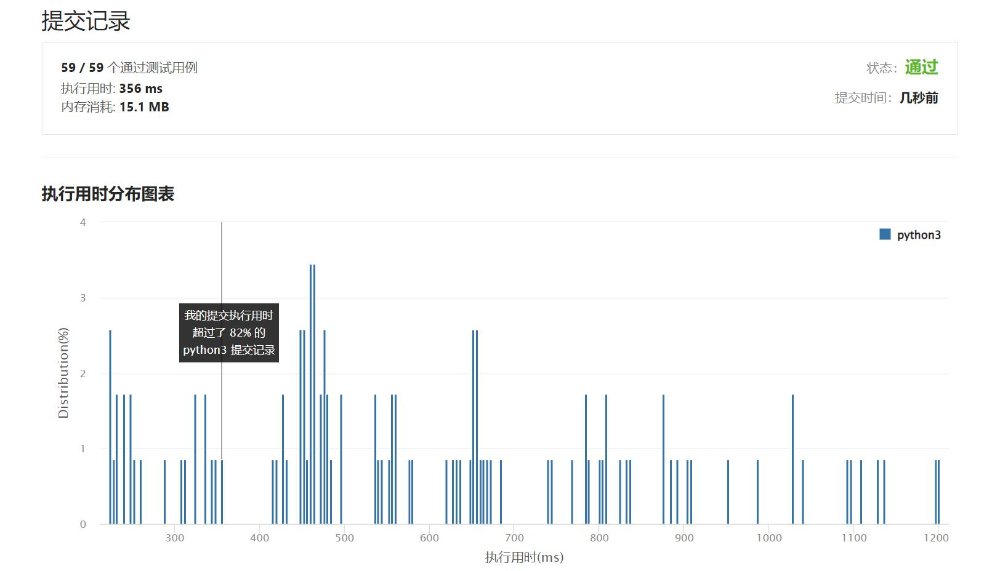

# 741-摘樱桃

Author：_Mumu

创建日期：2022/07/10

通过日期：2022/07/10

*****

踩过的坑：

1. 轻松愉快（指直接cv

已解决：396/2700

*****

难度：困难

问题描述：

一个N x N的网格(grid) 代表了一块樱桃地，每个格子由以下三种数字的一种来表示：

0 表示这个格子是空的，所以你可以穿过它。
1 表示这个格子里装着一个樱桃，你可以摘到樱桃然后穿过它。
-1 表示这个格子里有荆棘，挡着你的路。
你的任务是在遵守下列规则的情况下，尽可能的摘到最多樱桃：

从位置 (0, 0) 出发，最后到达 (N-1, N-1) ，只能向下或向右走，并且只能穿越有效的格子（即只可以穿过值为0或者1的格子）；
当到达 (N-1, N-1) 后，你要继续走，直到返回到 (0, 0) ，只能向上或向左走，并且只能穿越有效的格子；
当你经过一个格子且这个格子包含一个樱桃时，你将摘到樱桃并且这个格子会变成空的（值变为0）；
如果在 (0, 0) 和 (N-1, N-1) 之间不存在一条可经过的路径，则没有任何一个樱桃能被摘到。
示例 1:

输入: grid =
[[0, 1, -1],
 [1, 0, -1],
 [1, 1,  1]]
输出: 5
解释： 
玩家从（0,0）点出发，经过了向下走，向下走，向右走，向右走，到达了点(2, 2)。
在这趟单程中，总共摘到了4颗樱桃，矩阵变成了[[0,1,-1],[0,0,-1],[0,0,0]]。
接着，这名玩家向左走，向上走，向上走，向左走，返回了起始点，又摘到了1颗樱桃。
在旅程中，总共摘到了5颗樱桃，这是可以摘到的最大值了。
说明:

grid 是一个 N * N 的二维数组，N的取值范围是1 <= N <= 50。
每一个 grid[i][j] 都是集合 {-1, 0, 1}其中的一个数。
可以保证起点 grid[0][0] 和终点 grid[N-1][N-1] 的值都不会是 -1。

来源：力扣（LeetCode）
链接：https://leetcode.cn/problems/cherry-pickup