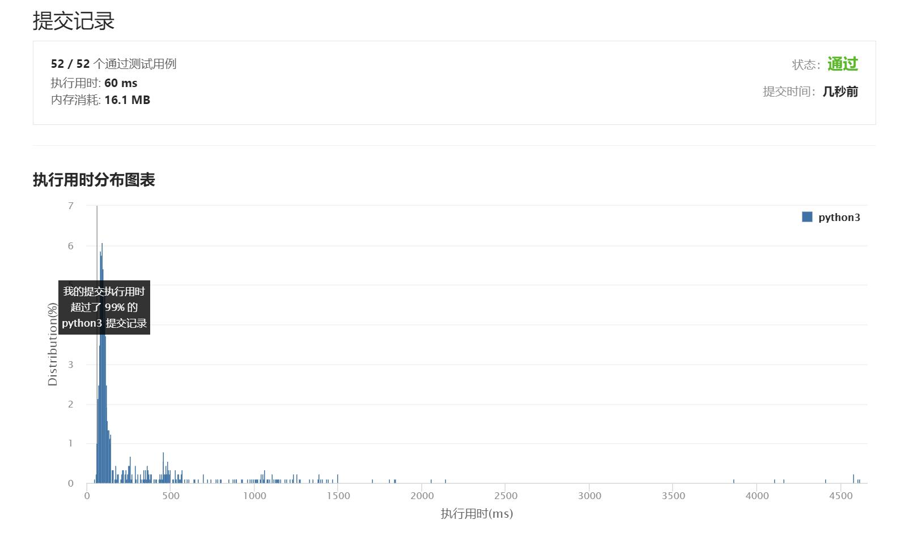

# 743-网络延迟时间

Author：_Mumu

创建日期：2021/8/2

通过日期：2021/8/2

*****

踩过的坑：

1. 我起了，看题解了
2. 第一反应是递归遍历全图更新，但是感觉不大对头，就去看题解了
3. 一看题解好家伙，Dijkstra这名字应该怎么念
4. 以前应该见过类似的思想，很眼熟，不过写是不大会写
5. 相当于学习怎么实现这个算法了
6. 建议看题解里【GTAlgorithm】的解答，很清晰，一看就会

已解决：59/2299

*****

难度：中等

问题描述：

有 n 个网络节点，标记为 1 到 n。

给你一个列表 times，表示信号经过 有向 边的传递时间。 times[i] = (ui, vi, wi)，其中 ui 是源节点，vi 是目标节点， wi 是一个信号从源节点传递到目标节点的时间。

现在，从某个节点 K 发出一个信号。需要多久才能使所有节点都收到信号？如果不能使所有节点收到信号，返回 -1 。

 

示例 1：

输入：times = [[2,1,1],[2,3,1],[3,4,1]], n = 4, k = 2
输出：2
示例 2：

输入：times = [[1,2,1]], n = 2, k = 1
输出：1
示例 3：

输入：times = [[1,2,1]], n = 2, k = 2
输出：-1

提示：

1 <= k <= n <= 100
1 <= times.length <= 6000
times[i].length == 3
1 <= ui, vi <= n
ui != vi
0 <= wi <= 100
所有 (ui, vi) 对都 互不相同（即，不含重复边）

来源：力扣（LeetCode）
链接：https://leetcode-cn.com/problems/network-delay-time