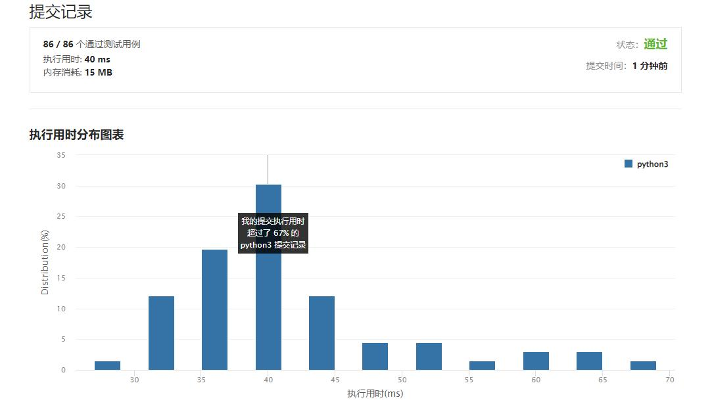

# 761-特殊的二进制序列

Author：_Mumu

创建日期：2022/08/08

通过日期：2022/08/08

*****

踩过的坑：

1. 轻松愉快（指直接cv

已解决：425/2736

*****

难度：困难

问题描述：

特殊的二进制序列是具有以下两个性质的二进制序列：

0 的数量与 1 的数量相等。
二进制序列的每一个前缀码中 1 的数量要大于等于 0 的数量。
给定一个特殊的二进制序列 S，以字符串形式表示。定义一个操作 为首先选择 S 的两个连续且非空的特殊的子串，然后将它们交换。（两个子串为连续的当且仅当第一个子串的最后一个字符恰好为第二个子串的第一个字符的前一个字符。)

在任意次数的操作之后，交换后的字符串按照字典序排列的最大的结果是什么？

示例 1:

输入: S = "11011000"
输出: "11100100"
解释:
将子串 "10" （在S[1]出现） 和 "1100" （在S[3]出现）进行交换。
这是在进行若干次操作后按字典序排列最大的结果。
说明:

S 的长度不超过 50。
S 保证为一个满足上述定义的特殊 的二进制序列。

来源：力扣（LeetCode）
链接：https://leetcode.cn/problems/special-binary-string